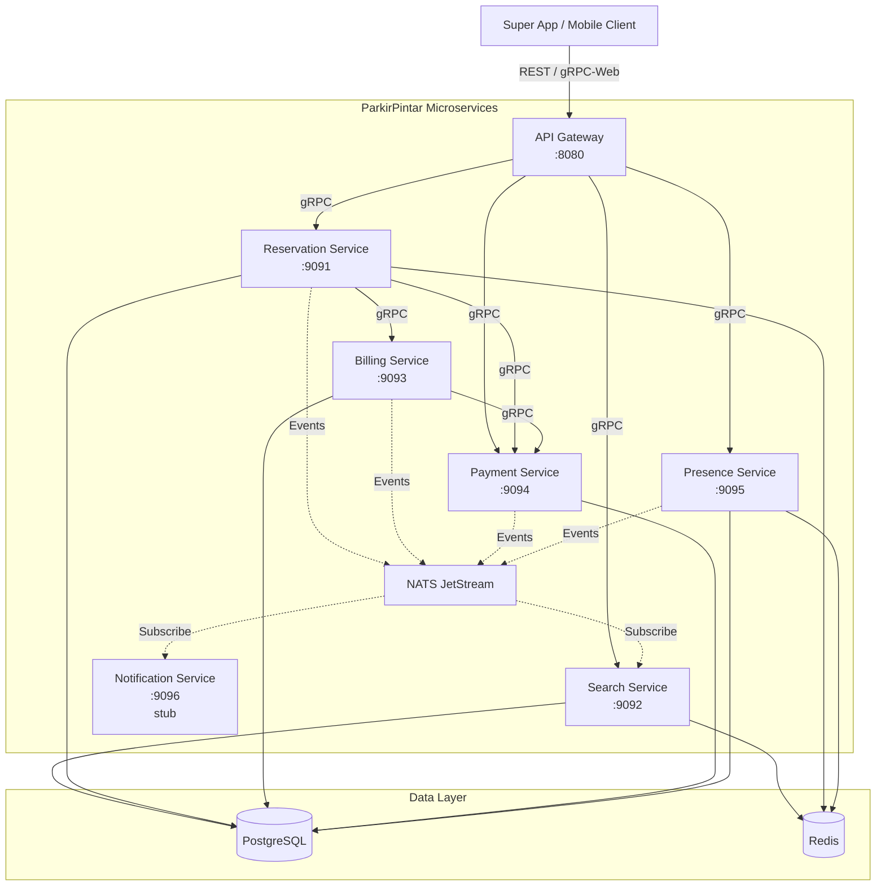

# ParkirPintar — Smart Parking Marketplace

A lightweight, fast smart parking backend system managing a single centralized parking area. Built with Go microservices communicating via gRPC over HTTP/2, backed by PostgreSQL, Redis, and NATS JetStream.

## Tech Stack

| Category | Technology |
|----------|-----------|
| Language | Go 1.25+ |
| HTTP Framework | Gin 1.12 |
| RPC | gRPC / Protocol Buffers |
| Database | PostgreSQL 14 |
| Cache & Locks | Redis 7.0 |
| Messaging | NATS JetStream |
| Observability | OpenTelemetry → Grafana (Tempo + Prometheus + Loki) |
| Containerization | Docker & Docker Compose |
| Reverse Proxy | Traefik |
| CI/CD | GitHub Actions / GitLab CI |

---

## Table of Contents

- [Architecture Overview](#architecture-overview)
- [Quick Start](#quick-start)
- [Project Structure](#project-structure)
- [API Overview](#api-overview)
- [Running Tests](#running-tests)
- [CI/CD Pipeline](#cicd-pipeline)
- [Monitoring & Observability](#monitoring--observability)
- [Documentation Index](#documentation-index)
- [Contributing](#contributing)
- [License](#license)

---

## Architecture Overview

ParkirPintar uses a microservices architecture with 7 Go services communicating via gRPC over HTTP/2. The API Gateway exposes REST endpoints and transcodes to internal gRPC calls.



### Service Responsibilities

| Service | Port | Responsibility |
|---------|------|----------------|
| **Gateway** | 8080 | REST entry point, JWT auth, rate limiting, gRPC transcoding |
| **Search** | 9092 | Real-time availability queries, floor maps, spot details |
| **Reservation** | 9091 | Spot reservation lifecycle, distributed locking, expiry worker |
| **Billing** | 9093 | Fee calculation (pricing engine), invoice generation, penalties |
| **Payment** | 9094 | Payment processing, QRIS integration, refunds |
| **Presence** | 9095 | Location streaming, geofence arrival detection, wrong-spot detection |
| **Notification** | 9096 | Push/SMS/Email notifications (stub — logs payloads) |

### Communication Patterns

- **Synchronous**: gRPC over HTTP/2 for all service-to-service calls
- **Asynchronous**: NATS JetStream for domain events (reservation.confirmed, billing.calculated, etc.)
- **Client-facing**: REST API via Gateway (transcodes to gRPC internally)

For full architecture details, see [docs/architecture/system-architecture.md](docs/architecture/system-architecture.md).

---

## Quick Start

### Prerequisites

- Go 1.25+
- Docker & Docker Compose
- protoc + protoc-gen-go + protoc-gen-go-grpc (for proto regeneration)

### Run with Docker Compose

```bash
# Clone and enter the project
git clone <repository-url>
cd parkir-pintar

# Copy environment config
cp config/.env.example config/.env
# Edit config/.env with your local values

# Start everything (infrastructure + all 7 services)
docker compose up -d

# Verify services are running
curl http://localhost:8080/health/ready
```

The Gateway API is available at `http://localhost:8080`.

### Run Locally (Development)

```bash
# Start infrastructure only
docker compose up -d postgres redis nats

# Run a specific service
go run ./cmd/gateway
go run ./cmd/search
go run ./cmd/reservation
# ... etc
```

### Makefile Targets

| Target | Description |
|---|---|
| `make test` | Run all unit tests |
| `make test-coverage` | Tests with coverage report |
| `make test-race` | Tests with race detector |
| `make test-e2e` | E2E tests (testcontainers-go) |
| `make test-e2e-docker` | E2E tests (Docker Compose) |
| `make test-e2e-all` | Both E2E test layers |
| `make lint` | Run golangci-lint |
| `make gosec` | Security scanner |
| `make gitleaks` | Secret scanning |
| `make proto-gen` | Regenerate proto Go code |
| `make build` | Build all binaries |
| `make docker-build` | Build Docker image |
| `make docker-run` | Run via Docker Compose |

---

## Project Structure

```
parkir-pintar/
├── cmd/                        # Service entry points (one per microservice)
│   ├── gateway/                # API Gateway (REST → gRPC transcoding)
│   ├── search/                 # Search Service
│   ├── reservation/            # Reservation Service + expiry worker
│   ├── billing/                # Billing Service
│   ├── payment/                # Payment Service
│   ├── presence/               # Presence Service
│   └── notification/           # Notification Service (stub)
├── internal/                   # Domain modules (clean architecture)
│   ├── gateway/handler/        # REST handlers → gRPC transcoding
│   ├── search/                 # handler, usecase, repository, subscriber
│   ├── reservation/            # handler, usecase, repository, model, worker
│   ├── billing/                # handler, usecase, repository, model
│   ├── payment/                # handler, usecase, repository, gateway
│   ├── presence/               # handler, usecase, repository, model
│   ├── notification/           # handler, usecase, subscriber
│   └── natssetup/              # Shared NATS stream configuration
├── pkg/                        # Reusable packages
│   ├── config/                 # Config loader (env vars + .env file)
│   ├── logger/                 # Structured logging (slog + OTEL)
│   ├── database/               # PostgreSQL client + traced wrapper
│   ├── redis/                  # Redis client + traced wrapper
│   ├── nats/                   # NATS JetStream client + traced wrapper
│   ├── tracing/                # OpenTelemetry tracer (OTLP gRPC/HTTP/stdout/noop)
│   ├── telemetry/              # Unified OTel init (Tracer + Meter + Logger providers)
│   ├── metrics/                # OTel metric instruments (HTTP, gRPC, DB, NATS, business)
│   ├── pricing/                # Pricing engine (pure functions)
│   ├── redislock/              # Distributed lock (SETNX + Lua release)
│   ├── circuitbreaker/         # Circuit breaker pattern
│   ├── grpcserver/             # gRPC server bootstrap
│   ├── grpcclient/             # gRPC client with keepalive + tracing
│   ├── grpcmiddleware/         # gRPC interceptors (auth, idempotency, rate limit, tracing, logging, recovery)
│   ├── middleware/             # HTTP middleware (auth, CORS, rate limit, tracing, recovery)
│   ├── httpclient/             # HTTP client (retry, tracing, SSRF protection)
│   ├── server/                 # Graceful HTTP server + shutdown manager
│   ├── health/                 # Health check endpoints
│   ├── auth/                   # JWT generation + validation
│   ├── apperror/               # Structured application errors
│   ├── response/               # Standardized JSON responses
│   └── crypto/                 # AES, RSA, HMAC-SHA256 utilities
├── proto/                      # Protocol Buffer definitions
│   ├── search/v1/              # SearchService proto + generated Go
│   ├── reservation/v1/         # ReservationService proto + generated Go
│   ├── billing/v1/             # BillingService proto + generated Go
│   ├── payment/v1/             # PaymentService proto + generated Go
│   ├── presence/v1/            # PresenceService proto + generated Go
│   └── notification/v1/        # NotificationService proto + generated Go
├── db/migrations/              # SQL migration files (schema + seed data)
├── tests/
│   ├── e2e/                    # End-to-end tests (testcontainers-go)
│   ├── e2e_docker/             # E2E tests (Docker Compose layer)
│   ├── integration/            # Integration tests (mock-based)
│   └── testhelpers/            # Shared test utilities
├── config/                     # Environment config templates
├── docs/                       # Documentation (see index below)
├── deploy/                     # Deployment configurations
├── docker-compose.yml          # Full stack (infra + 7 services)
├── Dockerfile                  # Multi-stage build (all 8 binaries)
├── Makefile                    # Development commands
├── .github/workflows/          # GitHub Actions CI/CD
└── .gitlab-ci.yml              # GitLab CI pipeline
```

---

## API Overview

The Gateway exposes a REST API at `http://localhost:8080/api/v1`. All endpoints require JWT authentication.

| Method | Path | Description |
|--------|------|-------------|
| GET | `/api/v1/search/availability` | Get parking availability by vehicle type |
| GET | `/api/v1/search/floors/:floor` | Get floor map (all spots with status) |
| GET | `/api/v1/search/spots/:id` | Get spot details |
| POST | `/api/v1/reservations` | Create reservation |
| GET | `/api/v1/reservations/:id` | Get reservation details |
| POST | `/api/v1/reservations/:id/cancel` | Cancel reservation |
| POST | `/api/v1/reservations/:id/check-in` | Check in |
| POST | `/api/v1/reservations/:id/check-out` | Check out (triggers billing + payment) |
| GET | `/api/v1/reservations/driver/:driverId` | Get driver's reservations |
| GET | `/api/v1/billing/:reservationId` | Get billing details |
| POST | `/api/v1/payments` | Process payment |
| GET | `/api/v1/payments/:id` | Get payment status |

**Health endpoints** (no auth): `/health`, `/health/live`, `/health/ready`, `/health/detailed`

For full API documentation with request/response examples, see [docs/api/api-reference.md](docs/api/api-reference.md).

---

## Running Tests

```bash
# All unit + integration tests
make test

# With race detector
make test-race

# E2E tests (requires Docker)
make test-e2e

# E2E tests via Docker Compose (full stack)
make test-e2e-docker

# Specific package
go test ./internal/reservation/usecase/...
go test ./pkg/pricing/...

# With coverage
make test-coverage
```

### Test Structure

| Layer | Location | Framework | Description |
|-------|----------|-----------|-------------|
| Unit | `*_test.go` alongside source | testify, rapid | Business logic, pricing rules, idempotency |
| Property-Based | `*_property_test.go` | pgregory.net/rapid | Formal correctness properties |
| Integration | `tests/integration/` | testify/mock | Cross-service flows with mocked dependencies |
| E2E (Layer 1) | `tests/e2e/` | testcontainers-go | Real PostgreSQL + Redis, full usecase flows |
| E2E (Layer 2) | `tests/e2e_docker/` | Docker Compose | Full stack with all services running |

---

## CI/CD Pipeline

### GitHub Actions

- **CI** (`.github/workflows/ci.yml`): secret scanning → lint → test (race + coverage) → gosec → SonarCloud
- **CD** (`.github/workflows/cd.yml`): test → build → Docker push → deploy

### GitLab CI

- **Pipeline** (`.gitlab-ci.yml`): lint → test → gosec + gitleaks + sonar → Docker build → deploy
  - Staging: auto-deploy on merge to `main`
  - Production: manual approval gate

### Quality Gates

| Check | Tool | Threshold |
|-------|------|-----------|
| Lint | golangci-lint | Zero warnings |
| Security | gosec | Zero high/critical |
| Secrets | gitleaks | Zero findings |
| Coverage | go test -cover | Tracked via SonarCloud |
| Race Conditions | go test -race | Zero races |

---

## Monitoring & Observability

All services export telemetry via OpenTelemetry SDK using OTLP gRPC:

```
Go Service (OTel SDK)
    ├── traces  → Alloy → Tempo
    ├── metrics → Alloy → Prometheus
    └── logs    → Alloy → Loki
                           ↓
                        Grafana (unified view)
```

| Signal | SDK | Exporter | Backend |
|--------|-----|----------|---------|
| Traces | `go.opentelemetry.io/otel` | otlptracegrpc | Tempo |
| Metrics | OTel SDK + periodic reader | otlpmetricgrpc | Prometheus |
| Logs | slog + otelslog bridge | otlploggrpc | Loki |

### Key Metrics

- **HTTP/gRPC**: request count, latency (p50/p95/p99), error rate by endpoint
- **Database**: query latency, connection pool utilization
- **NATS**: publish/subscribe count, consumer lag
- **Business**: reservations/min, check-in rate, revenue, occupancy %

### Health Endpoints

| Endpoint | Description |
|---|---|
| `GET /health` | Build info (service name, version, commit, build time) |
| `GET /health/live` | Liveness probe (always 200) |
| `GET /health/ready` | Readiness probe (checks PostgreSQL, Redis, NATS) |
| `GET /health/detailed` | Per-dependency status with check duration |

---

## Documentation Index

| Document | Description |
|----------|-------------|
| [docs/api/api-reference.md](docs/api/api-reference.md) | Full REST API reference with examples |
| [docs/architecture/system-architecture.md](docs/architecture/system-architecture.md) | System architecture deep-dive |
| [docs/architecture.md](docs/architecture.md) | Architecture overview (concise) |
| [docs/slo-sli.md](docs/slo-sli.md) | Service Level Objectives & Indicators |
| [docs/design/capacity-planning.md](docs/design/capacity-planning.md) | Capacity planning |
| [docs/design/api-versioning-strategy.md](docs/design/api-versioning-strategy.md) | API versioning strategy |
| [docs/deployment/deployment-strategy.md](docs/deployment/deployment-strategy.md) | Deployment strategy |
| [docs/deployment/disaster-recovery.md](docs/deployment/disaster-recovery.md) | Disaster recovery plan |
| [docs/incident-response/runbook.md](docs/incident-response/runbook.md) | Operational runbook |
| [docs/incident-response/post-mortem-template.md](docs/incident-response/post-mortem-template.md) | Post-mortem template |
| [docs/adr/](docs/adr/) | Architecture Decision Records |
| [docs/swagger.yaml](docs/swagger.yaml) | OpenAPI/Swagger specification |
| [PRD.md](PRD.md) | Product Requirements Document |

---

## Contributing

1. Create a feature branch (`git checkout -b feature/my-feature`)
2. Follow Go idioms and the project's clean architecture patterns
3. Add tests for new functionality
4. Run the quality pipeline:
   ```bash
   make lint && make test-race && make gosec && make gitleaks
   ```
5. Commit with conventional messages (`feat:`, `fix:`, `refactor:`)
6. Submit a merge request

See [CONTRIBUTING.md](CONTRIBUTING.md) for detailed guidelines.

---

## License

This project is proprietary software. All rights reserved.

---

## Acknowledgments

Built with Go and the following key libraries: Gin, gRPC, sqlx, go-redis, nats.go, OpenTelemetry, testcontainers-go, and testify. See [Third-Party Libraries](#third-party-libraries) for the full list.

---

## Appendix

<details>
<summary><strong>Entity Relationship Diagram</strong></summary>

```mermaid
erDiagram
    drivers {
        UUID id PK
        VARCHAR name
        VARCHAR phone UK
        VARCHAR email UK
        VARCHAR vehicle_type
        VARCHAR vehicle_plate
        TIMESTAMP created_at
        TIMESTAMP updated_at
    }

    parking_spots {
        UUID id PK
        INT floor_number
        INT spot_number
        VARCHAR vehicle_type
        VARCHAR spot_code UK
        VARCHAR status
        TIMESTAMP created_at
        TIMESTAMP updated_at
    }

    reservations {
        UUID id PK
        UUID driver_id FK
        UUID spot_id FK
        VARCHAR vehicle_type
        VARCHAR assignment_mode
        VARCHAR status
        VARCHAR idempotency_key UK
        TIMESTAMP confirmed_at
        TIMESTAMP expires_at
        TIMESTAMP checked_in_at
        TIMESTAMP checked_out_at
        TIMESTAMP cancelled_at
        TIMESTAMP created_at
        TIMESTAMP updated_at
    }

    billing_records {
        UUID id PK
        UUID reservation_id FK_UK
        BIGINT booking_fee
        BIGINT parking_fee
        BIGINT overnight_fee
        BIGINT cancellation_fee
        BIGINT penalty_amount
        BIGINT total_amount
        INT duration_minutes
        INT billed_hours
        BOOLEAN is_overnight
        VARCHAR idempotency_key UK
        VARCHAR status
        TIMESTAMP created_at
        TIMESTAMP updated_at
    }

    payments {
        UUID id PK
        UUID billing_id FK
        BIGINT amount
        VARCHAR payment_method
        VARCHAR payment_gateway
        VARCHAR transaction_ref
        VARCHAR idempotency_key UK
        VARCHAR status
        TIMESTAMP paid_at
        TIMESTAMP created_at
        TIMESTAMP updated_at
    }

    penalties {
        UUID id PK
        UUID reservation_id FK
        VARCHAR penalty_type
        BIGINT amount
        TEXT description
        TIMESTAMP created_at
    }

    presence_logs {
        UUID id PK
        UUID reservation_id FK
        DECIMAL latitude
        DECIMAL longitude
        FLOAT accuracy
        TIMESTAMP recorded_at
    }

    drivers ||--o{ reservations : "makes"
    parking_spots ||--o{ reservations : "assigned to"
    reservations ||--|| billing_records : "has"
    billing_records ||--o{ payments : "paid via"
    reservations ||--o{ penalties : "may have"
    reservations ||--o{ presence_logs : "tracked by"
```

</details>

<details>
<summary><strong>Parking Area Capacity</strong></summary>

| Floor | Car Spots | Motorcycle Spots | Total |
|-------|-----------|-----------------|-------|
| 1     | 30        | 50              | 80    |
| 2     | 30        | 50              | 80    |
| 3     | 30        | 50              | 80    |
| 4     | 30        | 50              | 80    |
| 5     | 30        | 50              | 80    |
| **Total** | **150** | **250**     | **400** |

Spot code format: `F{floor}-C-{number}` (car) or `F{floor}-M-{number}` (motorcycle)
Example: `F3-C-012` = Floor 3, Car, Spot 12

</details>

<details>
<summary><strong>Pricing Engine</strong></summary>

```
CalculateParkingFee(checkIn, checkOut):
    duration = checkOut - checkIn
    billedHours = ceil(duration.Hours())
    billedHours = max(billedHours, 1)
    parkingFee = billedHours × 5,000 IDR

    isOvernight = (checkIn.Date(WIB) != checkOut.Date(WIB))
    overnightFee = isOvernight ? 20,000 IDR : 0

    return parkingFee + overnightFee
```

- Booking fee: 5,000 IDR (charged at reservation confirmation)
- Cancellation penalty: 2,500 IDR (if cancelled after 2 minutes)
- No-show: booking fee forfeited, no additional penalty

</details>

<details>
<summary><strong>Double-Booking Prevention (3 Layers)</strong></summary>

1. **Redis Distributed Lock**: `SETNX lock:spot:{id}` with 30s TTL prevents concurrent reservation attempts on the same spot
2. **PostgreSQL SELECT FOR UPDATE**: Row-level lock on the spot during the transaction
3. **Partial Unique Index**: `CREATE UNIQUE INDEX ON reservations (spot_id) WHERE status IN ('confirmed', 'checked_in')` — database-level guarantee

</details>

<details>
<summary><strong>Third-Party Libraries</strong></summary>

| Library | Version | Justification |
|---------|---------|---------------|
| `github.com/gin-gonic/gin` | v1.12.0 | High-performance HTTP framework for the Gateway REST API |
| `github.com/jmoiron/sqlx` | v1.4.0 | Extends `database/sql` with struct scanning and named queries |
| `github.com/lib/pq` | v1.12.3 | PostgreSQL driver for `database/sql` |
| `github.com/go-redis/redis/v8` | v8.11.5 | Redis client with connection pooling, pipelining, and Lua script support |
| `github.com/nats-io/nats.go` | v1.51.0 | NATS client with JetStream support |
| `github.com/google/uuid` | v1.6.0 | RFC 4122 UUID generation |
| `github.com/golang-jwt/jwt/v4` | v4.5.2 | JWT token generation and validation |
| `google.golang.org/grpc` | v1.80.0 | gRPC framework for service-to-service communication |
| `google.golang.org/protobuf` | v1.36.11 | Protocol Buffers runtime |
| `go.opentelemetry.io/otel` | v1.43.0 | OpenTelemetry SDK for observability |
| `pgregory.net/rapid` | v1.2.0 | Property-based testing framework |
| `github.com/testcontainers/testcontainers-go` | v0.42.0 | Real containers for E2E tests |
| `github.com/stretchr/testify` | v1.11.1 | Assertion library for tests |

</details>
