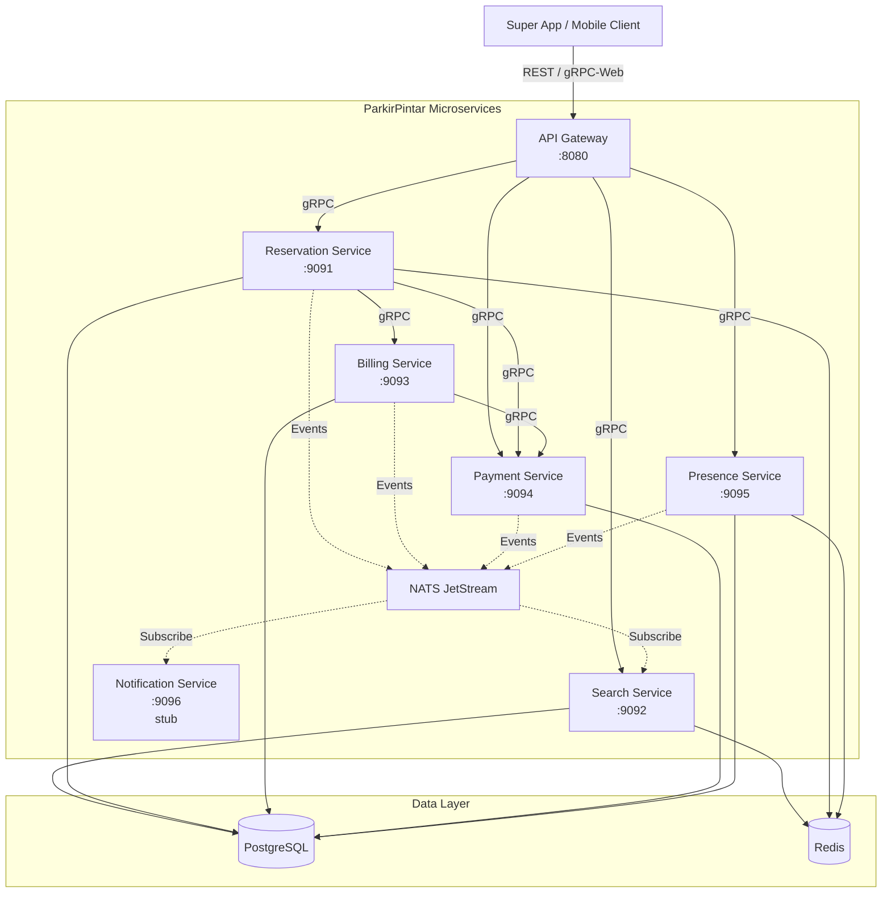
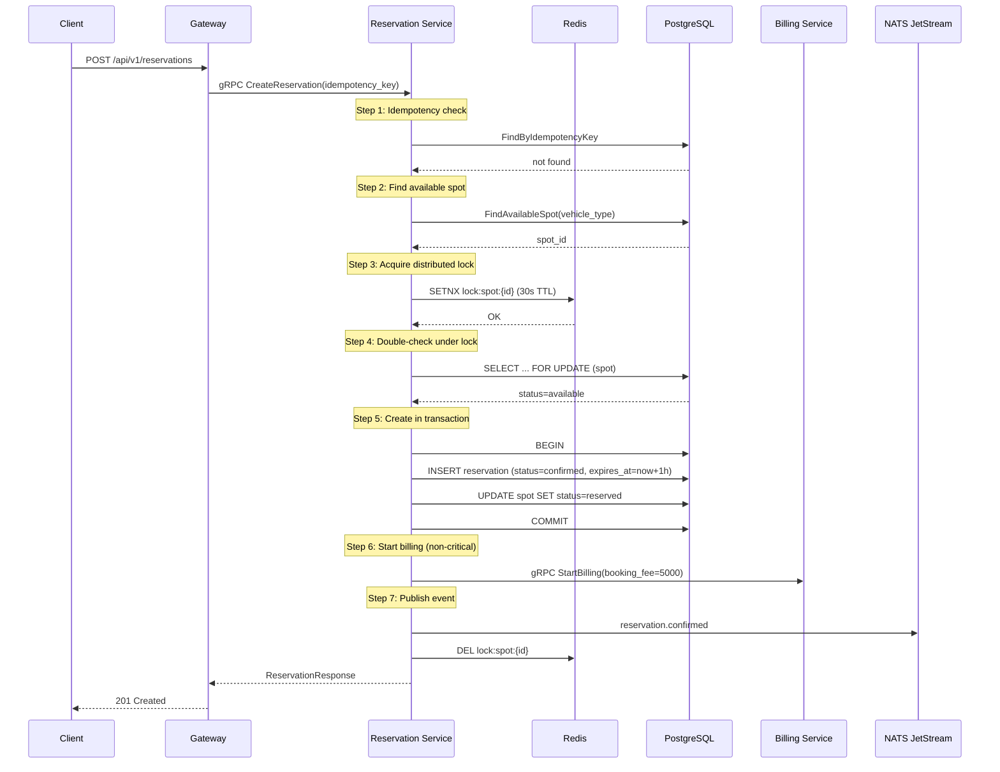
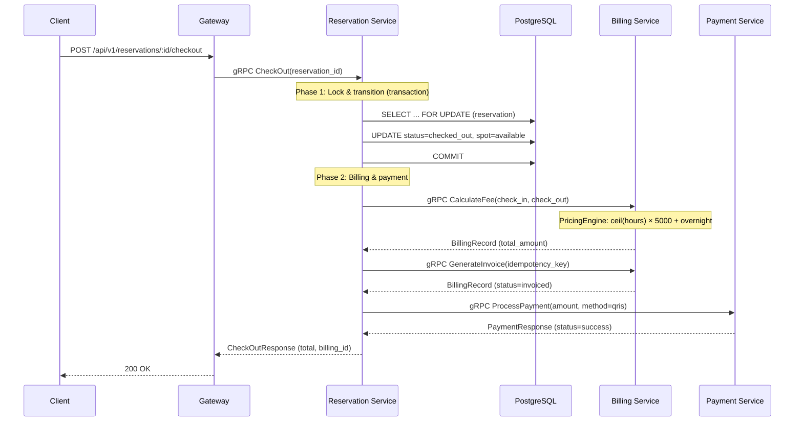
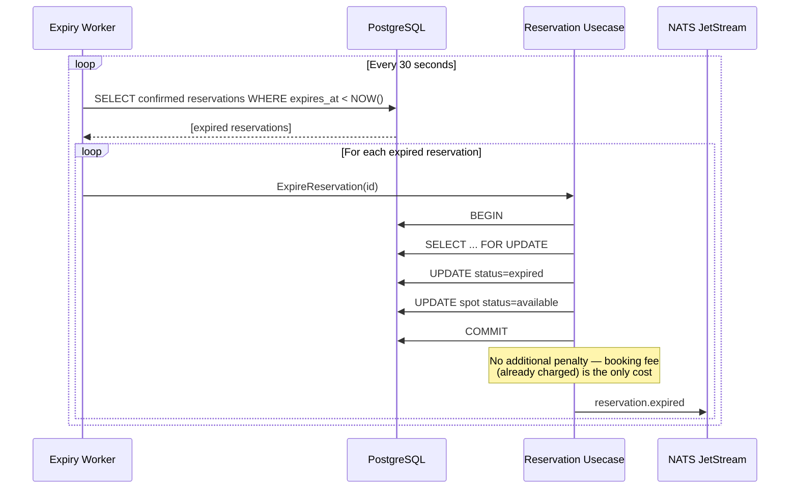

# ParkirPintar — Smart Parking Marketplace

A lightweight, fast smart parking backend system managing a single centralized parking area. Built with Go microservices communicating via gRPC over HTTP/2, backed by PostgreSQL, Redis, and NATS JetStream.

---

## Table of Contents

- [High-Level Design (HLD)](#high-level-design-hld)
- [Low-Level Design (LLD)](#low-level-design-lld)
- [Entity Relationship Diagram (ERD)](#entity-relationship-diagram-erd)
- [Infrastructure & Configuration](#infrastructure--configuration)
- [Project Structure](#project-structure)
- [Quick Start](#quick-start)
- [Running Tests](#running-tests)
- [Assumptions](#assumptions)
- [Third-Party Libraries](#third-party-libraries)

---

## High-Level Design (HLD)

### System Architecture



### Service Responsibilities

| Service | Port | Responsibility |
|---------|------|----------------|
| **Gateway** | 8080 | REST entry point, JWT auth, rate limiting, gRPC transcoding |
| **Search** | 9092 | Real-time availability queries, floor maps, spot details |
| **Reservation** | 9091 | Spot reservation lifecycle, distributed locking, expiry worker |
| **Billing** | 9093 | Fee calculation (pricing engine), invoice generation, penalties |
| **Payment** | 9094 | Payment processing, QRIS integration, refunds |
| **Presence** | 9095 | Location streaming, geofence arrival detection, wrong-spot detection |
| **Notification** | 9096 | Push/SMS/Email notifications (stub — logs payloads) |

### Communication Patterns

- **Synchronous**: gRPC over HTTP/2 for all service-to-service calls
- **Asynchronous**: NATS JetStream for domain events (reservation.confirmed, billing.calculated, etc.)
- **Client-facing**: REST API via Gateway (transcodes to gRPC internally)

---

## Low-Level Design (LLD)

### Reservation Flow (System-Assigned)



### Check-Out & Billing Flow



### Reservation Expiry (Background Worker)



### Pricing Engine Algorithm

```
CalculateParkingFee(checkIn, checkOut):
    duration = checkOut - checkIn
    billedHours = ceil(duration.Hours())
    billedHours = max(billedHours, 1)
    parkingFee = billedHours × 5,000 IDR

    isOvernight = (checkIn.Date(WIB) != checkOut.Date(WIB))
    overnightFee = isOvernight ? 20,000 IDR : 0

    return parkingFee + overnightFee
```

### Double-Booking Prevention (3 Layers)

1. **Redis Distributed Lock**: `SETNX lock:spot:{id}` with 30s TTL prevents concurrent reservation attempts on the same spot
2. **PostgreSQL SELECT FOR UPDATE**: Row-level lock on the spot during the transaction
3. **Partial Unique Index**: `CREATE UNIQUE INDEX ON reservations (spot_id) WHERE status IN ('confirmed', 'checked_in')` — database-level guarantee

### Idempotency Mechanism

- **Application level**: `idempotency_key` column with UNIQUE constraint on `reservations` and `billing_records`
- **gRPC middleware level**: Atomic SETNX + sentinel polling pattern in `pkg/grpcmiddleware/idempotency.go`
- On duplicate key: returns the existing record instead of creating a new one

### Circuit Breaker & Resilience

- **Circuit Breaker** (`pkg/circuitbreaker/`): 3-state (Closed → Open → HalfOpen) with configurable failure threshold and timeout
- **Retry with Backoff** (`pkg/httpclient/`): Exponential backoff for transient failures
- **Context-Aware Retries** (`internal/payment/usecase/`): Respects context cancellation during retry delays
- **Graceful Degradation**: Billing and notification failures are logged but don't fail the reservation flow

---

## Entity Relationship Diagram (ERD)

```mermaid
erDiagram
    drivers {
        UUID id PK
        VARCHAR name
        VARCHAR phone UK
        VARCHAR email UK
        VARCHAR vehicle_type
        VARCHAR vehicle_plate
        TIMESTAMP created_at
        TIMESTAMP updated_at
    }

    parking_spots {
        UUID id PK
        INT floor_number
        INT spot_number
        VARCHAR vehicle_type
        VARCHAR spot_code UK
        VARCHAR status
        TIMESTAMP created_at
        TIMESTAMP updated_at
    }

    reservations {
        UUID id PK
        UUID driver_id FK
        UUID spot_id FK
        VARCHAR vehicle_type
        VARCHAR assignment_mode
        VARCHAR status
        VARCHAR idempotency_key UK
        TIMESTAMP confirmed_at
        TIMESTAMP expires_at
        TIMESTAMP checked_in_at
        TIMESTAMP checked_out_at
        TIMESTAMP cancelled_at
        TIMESTAMP created_at
        TIMESTAMP updated_at
    }

    billing_records {
        UUID id PK
        UUID reservation_id FK_UK
        BIGINT booking_fee
        BIGINT parking_fee
        BIGINT overnight_fee
        BIGINT cancellation_fee
        BIGINT penalty_amount
        BIGINT total_amount
        INT duration_minutes
        INT billed_hours
        BOOLEAN is_overnight
        VARCHAR idempotency_key UK
        VARCHAR status
        TIMESTAMP created_at
        TIMESTAMP updated_at
    }

    payments {
        UUID id PK
        UUID billing_id FK
        BIGINT amount
        VARCHAR payment_method
        VARCHAR payment_gateway
        VARCHAR transaction_ref
        VARCHAR idempotency_key UK
        VARCHAR status
        TIMESTAMP paid_at
        TIMESTAMP created_at
        TIMESTAMP updated_at
    }

    penalties {
        UUID id PK
        UUID reservation_id FK
        VARCHAR penalty_type
        BIGINT amount
        TEXT description
        TIMESTAMP created_at
    }

    presence_logs {
        UUID id PK
        UUID reservation_id FK
        DECIMAL latitude
        DECIMAL longitude
        FLOAT accuracy
        TIMESTAMP recorded_at
    }

    drivers ||--o{ reservations : "makes"
    parking_spots ||--o{ reservations : "assigned to"
    reservations ||--|| billing_records : "has"
    billing_records ||--o{ payments : "paid via"
    reservations ||--o{ penalties : "may have"
    reservations ||--o{ presence_logs : "tracked by"
```

### Parking Area Capacity

| Floor | Car Spots | Motorcycle Spots | Total |
|-------|-----------|-----------------|-------|
| 1     | 30        | 50              | 80    |
| 2     | 30        | 50              | 80    |
| 3     | 30        | 50              | 80    |
| 4     | 30        | 50              | 80    |
| 5     | 30        | 50              | 80    |
| **Total** | **150** | **250**     | **400** |

Spot code format: `F{floor}-C-{number}` (car) or `F{floor}-M-{number}` (motorcycle)  
Example: `F3-C-012` = Floor 3, Car, Spot 12

---

## Infrastructure & Configuration

### Docker Compose Services

| Service | Image | Purpose | Port |
|---------|-------|---------|------|
| postgres | postgres:14-alpine | Primary data store | 5432 |
| redis | redis:7.0-alpine | Cache, distributed locks, presence streams | 6379 |
| nats | nats:latest | JetStream event bus | 4222, 8222 |
| gateway | parkir-pintar (multi-binary) | REST API entry point | 8080 |
| search | parkir-pintar | Availability queries | 9092 |
| reservation | parkir-pintar | Reservation lifecycle | 9091 |
| billing | parkir-pintar | Fee calculation | 9093 |
| payment | parkir-pintar | Payment processing | 9094 |
| presence | parkir-pintar | Location & geofence | 9095 |
| notification | parkir-pintar | Notifications (stub) | 9096 |

### NATS JetStream Configuration

| Stream | Subjects | Retention | Storage | Max Age |
|--------|----------|-----------|---------|---------|
| RESERVATIONS | reservation.confirmed, .checked_in, .checked_out, .expired, .cancelled | Limits | File | 72h |
| BILLING | billing.calculated, billing.invoiced | Limits | File | 72h |
| PAYMENTS | payment.success, payment.failed | Limits | File | 72h |
| PRESENCE | presence.arrival, presence.wrong_spot | Limits | File | 72h |

### Redis Configuration

- **Distributed Locks**: `SETNX` with 30s TTL for spot reservation locking
- **Cache**: Search availability results with singleflight coalescing
- **Presence Streams**: Redis Streams for real-time location data
- **Idempotency**: gRPC middleware uses atomic SETNX for request deduplication
- **Rate Limiting**: Per-IP token bucket state stored in Redis

### Load Balancing & Scaling

In production, the system is designed for horizontal scaling:

- **Gateway**: Stateless — scale horizontally behind an L7 load balancer (e.g., NGINX, AWS ALB, or Kubernetes Ingress)
- **gRPC Services**: Use client-side load balancing via gRPC's built-in round-robin or a service mesh (e.g., Istio, Linkerd)
- **PostgreSQL**: Single primary with read replicas for search queries
- **Redis**: Cluster mode for high availability; Sentinel for failover
- **NATS**: Built-in clustering with JetStream replication (configured via `Replicas` field)

For local development, Docker Compose provides all services on a single host with health checks and dependency ordering.

### Cloud Deployment (Reference Architecture)

```
┌─────────────────────────────────────────────────────────┐
│                    Kubernetes Cluster                    │
│                                                         │
│  ┌─────────────┐  ┌─────────────┐  ┌──────────────┐   │
│  │ Ingress/ALB │  │ Service Mesh│  │ HPA (auto-   │   │
│  │ (TLS term.) │  │ (mTLS, LB)  │  │  scaling)    │   │
│  └──────┬──────┘  └─────────────┘  └──────────────┘   │
│         │                                               │
│  ┌──────▼──────────────────────────────────────────┐   │
│  │  Pods: gateway, search, reservation, billing,   │   │
│  │        payment, presence, notification          │   │
│  └─────────────────────────────────────────────────┘   │
│                                                         │
│  ┌─────────────┐  ┌─────────────┐  ┌──────────────┐   │
│  │ RDS/Aurora  │  │ ElastiCache │  │ NATS Cluster │   │
│  │ (PostgreSQL)│  │ (Redis)     │  │ (JetStream)  │   │
│  └─────────────┘  └─────────────┘  └──────────────┘   │
└─────────────────────────────────────────────────────────┘
```

---

## Project Structure

```
parkir-pintar/
├── cmd/                        # Service entry points (one per microservice)
│   ├── api/                    # Legacy API entry point
│   ├── gateway/                # API Gateway (REST → gRPC transcoding)
│   ├── search/                 # Search Service
│   ├── reservation/            # Reservation Service + expiry worker
│   ├── billing/                # Billing Service
│   ├── payment/                # Payment Service
│   ├── presence/               # Presence Service
│   └── notification/           # Notification Service (stub)
├── internal/                   # Domain modules (clean architecture)
│   ├── gateway/handler/        # REST handlers → gRPC transcoding
│   ├── search/                 # handler, usecase, repository, subscriber
│   ├── reservation/            # handler, usecase, repository, model, worker
│   ├── billing/                # handler, usecase, repository, model
│   ├── payment/                # handler, usecase, repository, gateway
│   ├── presence/               # handler, usecase, repository, model
│   ├── notification/           # handler, usecase, subscriber
│   └── natssetup/              # Shared NATS stream configuration
├── pkg/                        # Reusable packages
│   ├── config/                 # Config loader (env vars + .env file)
│   ├── logger/                 # Structured logging (slog + OTEL)
│   ├── database/               # PostgreSQL client + traced wrapper
│   ├── redis/                  # Redis client + traced wrapper
│   ├── nats/                   # NATS JetStream client + traced wrapper
│   ├── tracing/                # OpenTelemetry (stdout/OTLP/New Relic/noop)
│   ├── pricing/                # Pricing engine (pure functions)
│   ├── redislock/              # Distributed lock (SETNX + Lua release)
│   ├── circuitbreaker/         # Circuit breaker pattern
│   ├── grpcserver/             # gRPC server bootstrap
│   ├── grpcclient/             # gRPC client with keepalive + tracing
│   ├── grpcmiddleware/         # gRPC interceptors (auth, idempotency, rate limit, tracing, logging, recovery)
│   ├── middleware/             # HTTP middleware (auth, CORS, rate limit, tracing, recovery)
│   ├── httpclient/             # HTTP client (retry, tracing, SSRF protection)
│   ├── server/                 # Graceful HTTP server + shutdown manager
│   ├── health/                 # Health check endpoints
│   ├── auth/                   # JWT generation + validation
│   ├── apperror/               # Structured application errors
│   ├── response/               # Standardized JSON responses
│   └── crypto/                 # AES, RSA, HMAC-SHA256 utilities
├── proto/                      # Protocol Buffer definitions
│   ├── search/v1/              # SearchService proto + generated Go
│   ├── reservation/v1/         # ReservationService proto + generated Go
│   ├── billing/v1/             # BillingService proto + generated Go
│   ├── payment/v1/             # PaymentService proto + generated Go
│   ├── presence/v1/            # PresenceService proto + generated Go
│   └── notification/v1/        # NotificationService proto + generated Go
├── db/migrations/              # SQL migration files (schema + seed data)
├── tests/
│   ├── e2e/                    # End-to-end tests (testcontainers-go)
│   ├── e2e_docker/             # E2E tests (Docker Compose layer)
│   ├── integration/            # Integration tests (mock-based)
│   └── testhelpers/            # Shared test utilities
├── config/                     # Environment config templates
├── docs/                       # Additional documentation
├── docker-compose.yml          # Full stack (infra + 7 services)
├── Dockerfile                  # Multi-stage build (all 8 binaries)
├── Makefile                    # Development commands
├── .github/workflows/          # GitHub Actions CI/CD
├── .gitlab-ci.yml              # GitLab CI pipeline
└── PRD.md                      # Product Requirements Document
```

---

## Quick Start

### Prerequisites

- Go 1.25+
- Docker & Docker Compose
- protoc + protoc-gen-go + protoc-gen-go-grpc (for proto regeneration)

### Local Development

```bash
# Clone and enter the project
cd parkir-pintar

# Copy environment config
cp config/.env.example config/.env
# Edit config/.env with your local values

# Start infrastructure (PostgreSQL, Redis, NATS)
docker compose up -d postgres redis nats

# Run all services
docker compose up -d

# Or run a specific service locally
go run ./cmd/gateway
```

The Gateway API is available at `http://localhost:8080`.

### Makefile Targets

| Target | Description |
|---|---|
| `make test` | Run all unit tests |
| `make test-coverage` | Tests with coverage report |
| `make test-race` | Tests with race detector |
| `make test-e2e` | E2E tests (testcontainers-go) |
| `make test-e2e-docker` | E2E tests (Docker Compose) |
| `make test-e2e-all` | Both E2E test layers |
| `make lint` | Run golangci-lint |
| `make gosec` | Security scanner |
| `make gitleaks` | Secret scanning |
| `make proto-gen` | Regenerate proto Go code |
| `make build` | Build all binaries |
| `make docker-build` | Build Docker image |
| `make docker-run` | Run via Docker Compose |

---

## Running Tests

```bash
# All unit + integration tests
make test

# With race detector
make test-race

# E2E tests (requires Docker)
make test-e2e

# Specific package
go test ./internal/reservation/usecase/...
go test ./pkg/pricing/...

# With coverage
make test-coverage
```

### Test Structure

| Layer | Location | Framework | Description |
|-------|----------|-----------|-------------|
| Unit | `*_test.go` alongside source | testify, rapid | Business logic, pricing rules, idempotency |
| Property-Based | `*_property_test.go` | pgregory.net/rapid | Formal correctness properties |
| Integration | `tests/integration/` | testify/mock | Cross-service flows with mocked dependencies |
| E2E (Layer 1) | `tests/e2e/` | testcontainers-go | Real PostgreSQL + Redis, full usecase flows |
| E2E (Layer 2) | `tests/e2e_docker/` | Docker Compose | Full stack with all services running |

---

## Assumptions

1. The parking area is a single building with a fixed layout (5 floors, 30 car + 50 motorcycle spots per floor). The layout does not change at runtime.
2. Each Driver has one vehicle type per session (car or motorcycle). A Driver cannot reserve spots for multiple vehicles simultaneously.
3. The Driver's smartphone has GPS/location services enabled and the app has location permissions.
4. Geofence detection is based on GPS coordinates provided by the client app; the backend does not integrate with physical sensors or barriers.
5. The payment gateway and QRIS provider are external third-party services; the Payment Service integrates via their APIs (stubbed for testing).
6. The Notification Service is a stub — it logs notification payloads but does not send actual messages.
7. Wrong-spot detection relies on presence/location data from the Driver's phone; accuracy depends on GPS precision.
8. All monetary values are in IDR (Indonesian Rupiah) stored as `BIGINT` (no floating point).
9. The system operates in WIB (UTC+7) for overnight fee calculation.
10. The super app handles Driver registration and authentication; ParkirPintar receives a valid JWT token from the super app.
11. There is no physical barrier integration — check-in and check-out are app-driven (geofence or manual).
12. Database is PostgreSQL; caching and locking use Redis; async messaging uses NATS JetStream.
13. For testing purposes, payment gateway responses are simulated via a configurable stub gateway.
14. No-show policy: the booking fee (5,000 IDR, charged at confirmation) is the only cost forfeited — no additional penalty is applied on reservation expiry.

---

## Third-Party Libraries

| Library | Version | Justification |
|---------|---------|---------------|
| `github.com/gin-gonic/gin` | v1.12.0 | High-performance HTTP framework for the Gateway REST API. Mature, well-documented, and widely adopted in Go. |
| `github.com/jmoiron/sqlx` | v1.4.0 | Extends `database/sql` with struct scanning and named queries. Avoids ORM complexity while reducing boilerplate. |
| `github.com/lib/pq` | v1.12.3 | PostgreSQL driver for `database/sql`. Production-proven, supports all PG features needed. |
| `github.com/go-redis/redis/v8` | v8.11.5 | Redis client with connection pooling, pipelining, and Lua script support. Required for distributed locks and caching. |
| `github.com/nats-io/nats.go` | v1.51.0 | NATS client with JetStream support for async event publishing and consumption between services. |
| `github.com/google/uuid` | v1.6.0 | RFC 4122 UUID generation for primary keys and idempotency keys. |
| `github.com/golang-jwt/jwt/v4` | v4.5.2 | JWT token generation and validation for API authentication. |
| `github.com/joho/godotenv` | v1.5.1 | Loads `.env` files for local development configuration. |
| `github.com/gin-contrib/cors` | v1.7.7 | CORS middleware for Gin with explicit origin configuration. |
| `google.golang.org/grpc` | v1.80.0 | gRPC framework for service-to-service communication over HTTP/2. Required by the architecture. |
| `google.golang.org/protobuf` | v1.36.11 | Protocol Buffers runtime for gRPC message serialization. |
| `go.opentelemetry.io/otel` | v1.43.0 | OpenTelemetry SDK for distributed tracing across all services. |
| `golang.org/x/sync` | v0.20.0 | `singleflight` package to prevent cache stampedes on concurrent cache misses. |
| `pgregory.net/rapid` | v1.2.0 | Property-based testing framework for formal correctness verification. |
| `github.com/testcontainers/testcontainers-go` | v0.42.0 | Spins up real PostgreSQL/Redis containers for E2E tests. Ensures tests run against real infrastructure. |
| `github.com/DATA-DOG/go-sqlmock` | v1.5.2 | SQL mock for unit testing repository layer without a real database. |
| `github.com/alicebob/miniredis/v2` | v2.37.0 | In-memory Redis mock for unit testing Redis-dependent code. |
| `github.com/stretchr/testify` | v1.11.1 | Assertion library (`assert`, `require`, `mock`) for readable test code. |

---

## Health Endpoints

| Endpoint | Description |
|---|---|
| `GET /health` | Build info (service name, version, commit, build time) |
| `GET /health/live` | Liveness probe (always 200) |
| `GET /health/ready` | Readiness probe (checks PostgreSQL, Redis, NATS) |
| `GET /health/detailed` | Per-dependency status with check duration |

---

## API Endpoints (Gateway)

| Method | Path | Description |
|--------|------|-------------|
| POST | `/api/v1/reservations` | Create reservation (system-assigned or user-selected) |
| DELETE | `/api/v1/reservations/:id` | Cancel reservation |
| POST | `/api/v1/reservations/:id/checkin` | Check in |
| POST | `/api/v1/reservations/:id/checkout` | Check out (triggers billing + payment) |
| GET | `/api/v1/availability` | Get parking availability by vehicle type |
| GET | `/api/v1/floors/:floor` | Get floor map (all spots with status) |
| GET | `/api/v1/spots/:id` | Get spot details |
| POST | `/api/v1/presence/stream` | Submit location update |
| GET | `/api/v1/payments/:id/status` | Get payment status |

All endpoints require JWT authentication via `Authorization: Bearer <token>`.

---

## CI/CD

- **GitHub Actions CI** (`.github/workflows/ci.yml`): secret scanning → lint → test (race + coverage) → gosec → SonarCloud
- **GitHub Actions CD** (`.github/workflows/cd.yml`): test → build → Docker push → deploy
- **GitLab CI** (`.gitlab-ci.yml`): lint → test → gosec + gitleaks + sonar → Docker build → deploy (staging auto, production manual)

---

## Contributing

1. Create a feature branch (`git checkout -b feature/my-feature`)
2. Follow Go idioms and the project's clean architecture patterns
3. Add tests for new functionality
4. Run the quality pipeline: `make lint && make test-race && make gosec && make gitleaks`
5. Commit with conventional messages (`feat:`, `fix:`, `refactor:`)
6. Submit a merge request
