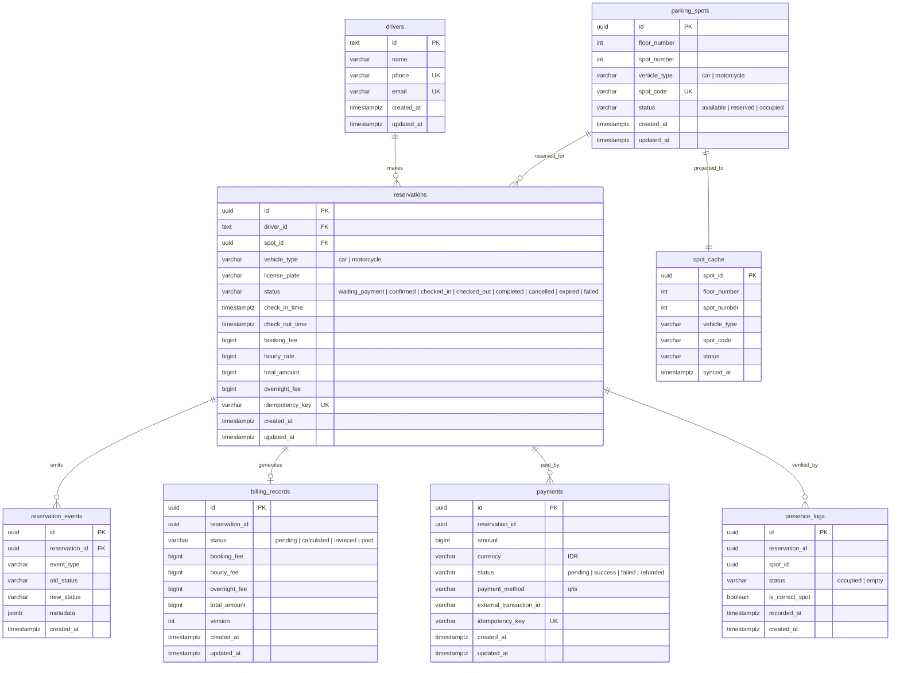

# Entity-Relationship Diagram — ParkirPintar

## Overview

ParkirPintar uses a schema-per-service pattern within a single PostgreSQL instance. Each microservice owns its schema. Cross-service data access happens exclusively through gRPC and NATS events.

---

## ER Diagram (Mermaid)



---

## Schema Ownership

| Schema | Service | Tables |
|--------|---------|--------|
| `reservation` | Reservation | `drivers`, `parking_spots`, `reservations`, `reservation_events` |
| `billing` | Billing | `billing_records` |
| `payment` | Payment | `payments` |
| `presence` | Presence | `presence_logs` |
| `search` | Search | `spot_cache` |

All schemas live in a single `parkir_pintar` database. Services never query another service's schema directly.

---

## Cross-Service References

Services store IDs from other services but do not enforce foreign keys across schemas:

- `billing_records.reservation_id` → references `reservations.id` (no FK)
- `payments.reservation_id` → references `reservations.id` (no FK)
- `presence_logs.reservation_id` → references `reservations.id` (no FK)
- `presence_logs.spot_id` → references `parking_spots.id` (no FK)

Data consistency across services is maintained through NATS events and eventual consistency.

---

## Index Strategy

```sql
-- Reservation
CREATE INDEX idx_parking_spots_availability ON reservation.parking_spots (vehicle_type, status, floor_number);
CREATE UNIQUE INDEX parking_spots_spot_code_key ON reservation.parking_spots (spot_code);
CREATE INDEX idx_reservations_driver ON reservation.reservations (driver_id);
CREATE INDEX idx_reservations_spot_status ON reservation.reservations (spot_id, status);
CREATE UNIQUE INDEX idx_reservations_idempotency ON reservation.reservations (idempotency_key);

-- Billing
CREATE INDEX idx_billing_reservation ON billing.billing_records (reservation_id);

-- Payment
CREATE INDEX idx_payments_reservation ON payment.payments (reservation_id);
CREATE UNIQUE INDEX idx_payments_idempotency ON payment.payments (idempotency_key);

-- Presence
CREATE INDEX idx_presence_reservation_time ON presence.presence_logs (reservation_id, recorded_at);
```
