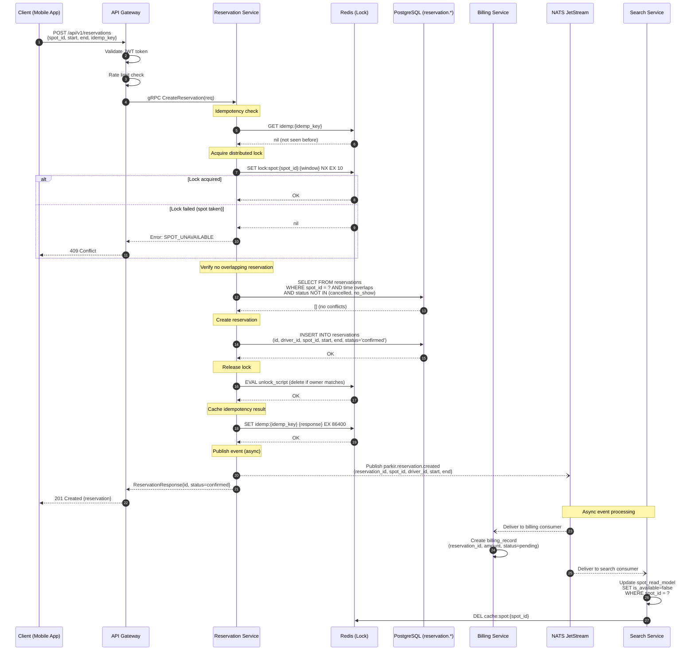
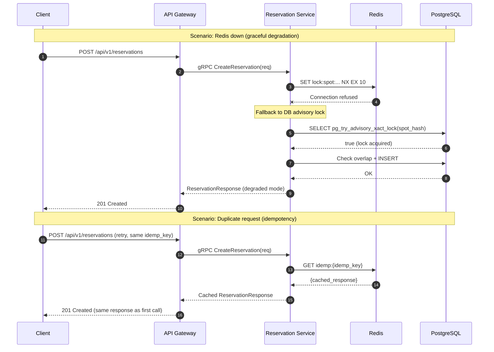
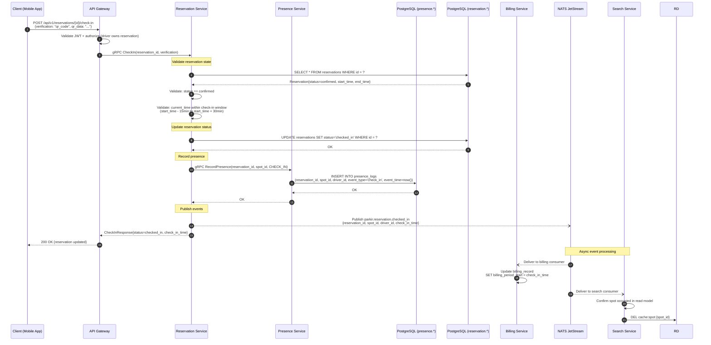
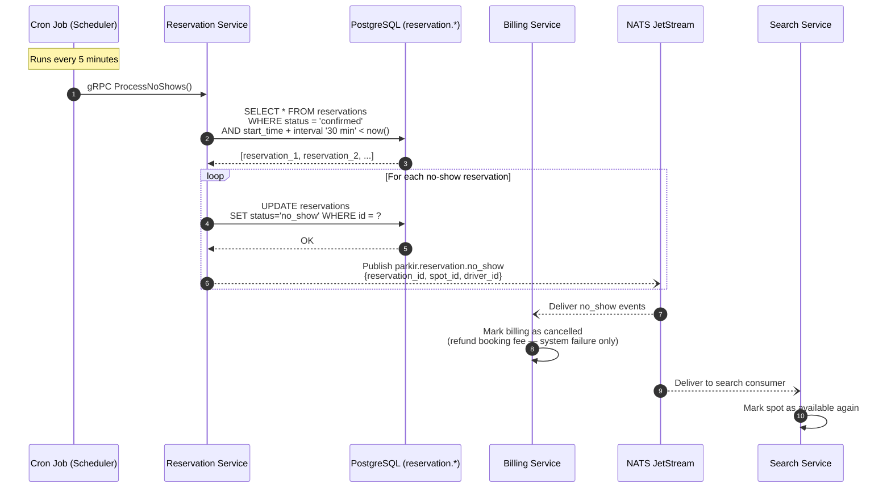
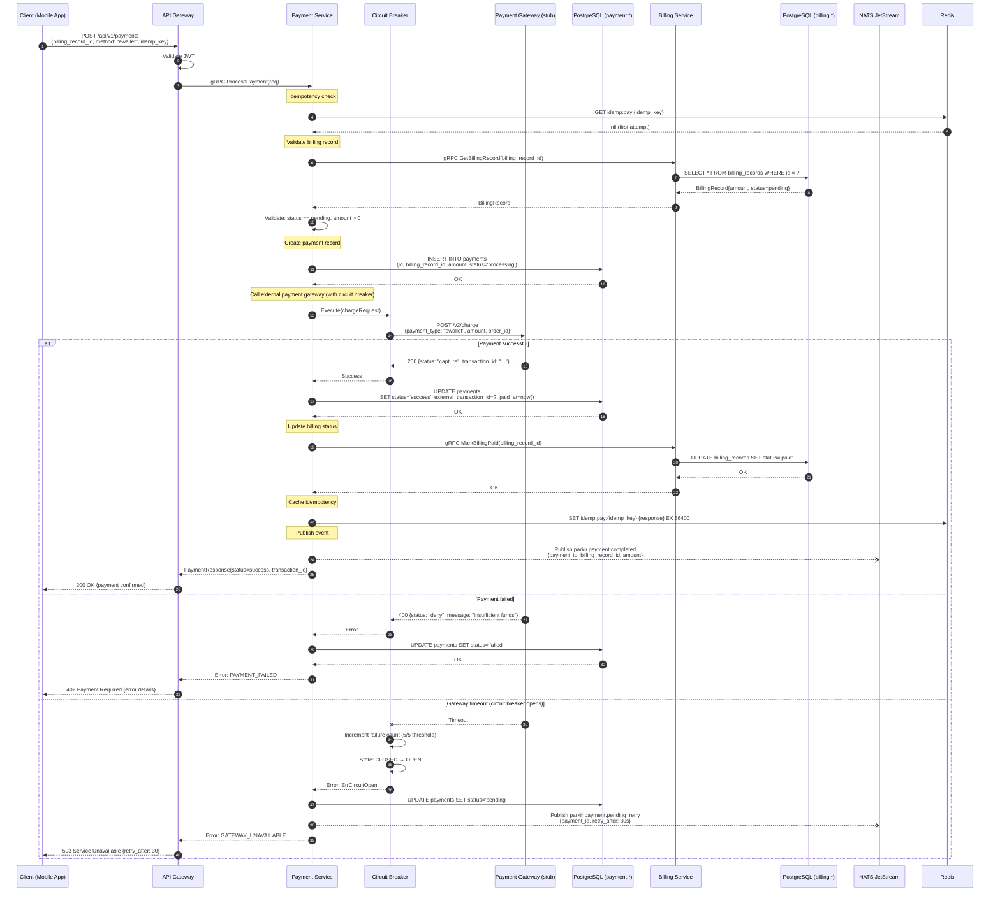
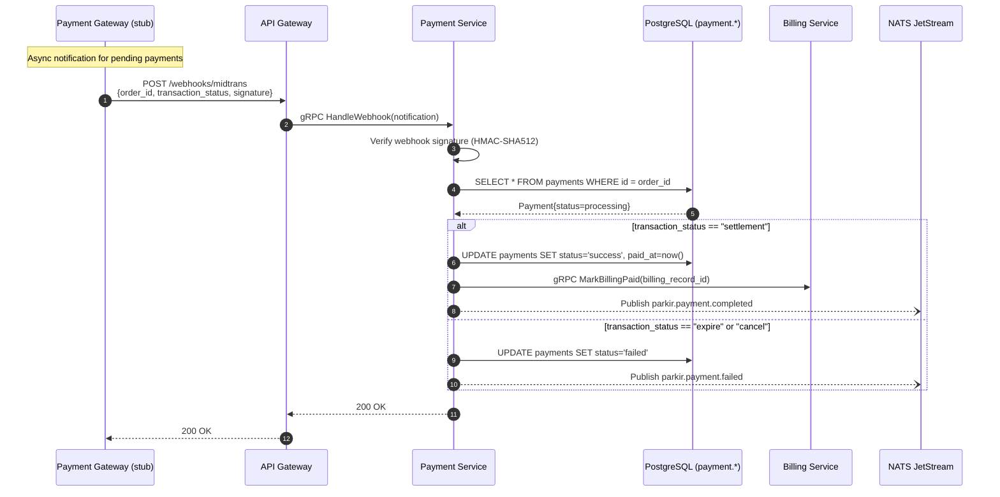
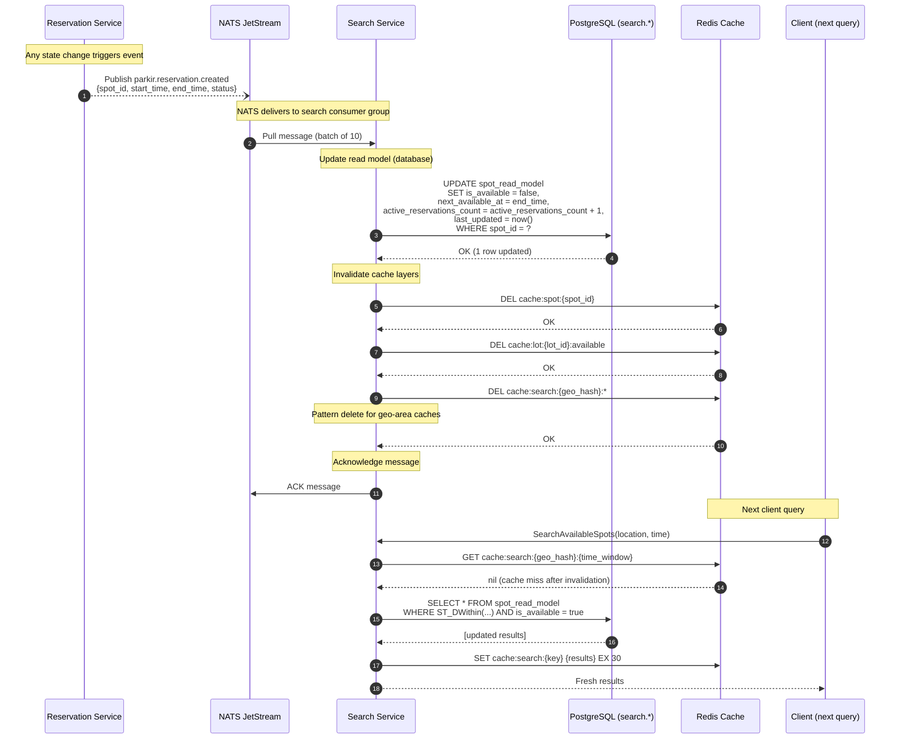
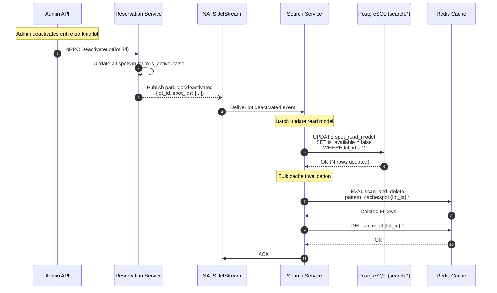
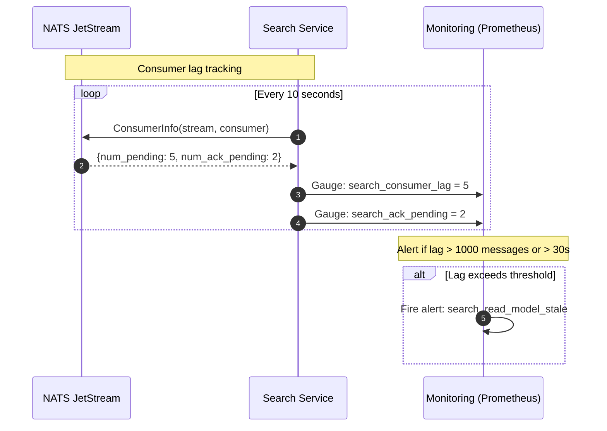
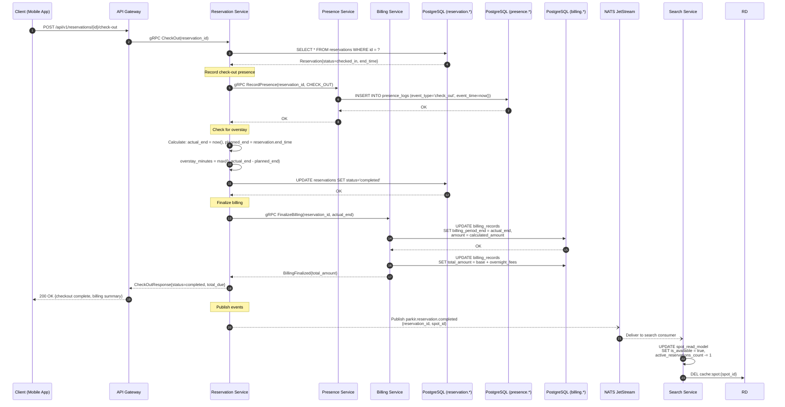

# Sequence Diagrams — ParkirPintar

Key interaction flows documented in Mermaid sequence diagram syntax.

---

## 1. Create Reservation Flow

The critical path for booking a parking spot. Uses distributed locking to prevent double-booking.

### Error Scenarios

---

## 2. Check-in Flow

Driver arrives at parking spot and checks in via QR code scan.

### Late Check-in / No-Show Detection

---

## 3. Payment Flow

Driver pays for a completed reservation via Payment Gateway payment gateway.

### Payment Result (NATS Event)

---

## 4. Cache Invalidation Flow

Event-driven cache invalidation ensures the search read model stays fresh.

### Bulk Invalidation (Lot Status Change)

### Consistency Guarantee: Lag Monitoring

---

## 5. Check-out and Billing Finalization

