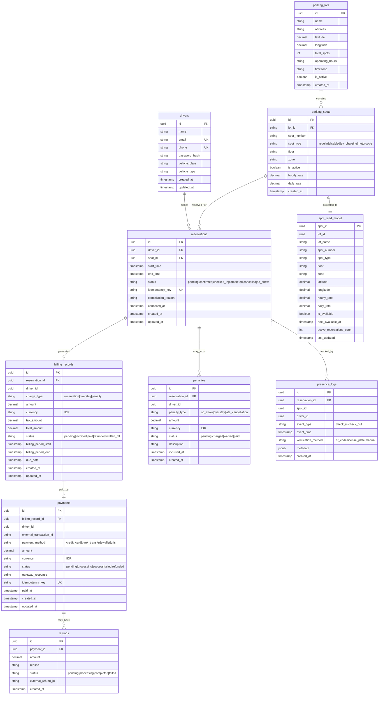

# Entity-Relationship Diagram — ParkirPintar

## Overview

ParkirPintar uses a database-per-service pattern. Each microservice owns its schema and tables. Cross-service data access happens exclusively through APIs and events, never direct database queries.

---

## ER Diagram (Mermaid)



---

## Schema Ownership

| Schema | Service | Tables | Database |
|--------|---------|--------|----------|
| `reservation` | Reservation Service | `drivers`, `parking_lots`, `parking_spots`, `reservations` | `parkir_reservation` |
| `billing` | Billing Service | `billing_records`, `penalties` | `parkir_billing` |
| `payment` | Payment Service | `payments`, `refunds` | `parkir_payment` |
| `presence` | Presence Service | `presence_logs` | `parkir_presence` |
| `search` | Search Service | `spot_read_model` | `parkir_search` |

Each service has its own PostgreSQL database (or schema within a shared instance in non-production). Services never query another service's tables directly.

---

## Relationships and Cardinality

| Relationship | Cardinality | Description |
|-------------|-------------|-------------|
| parking_lots → parking_spots | 1:N | A lot contains many spots |
| drivers → reservations | 1:N | A driver can have many reservations |
| parking_spots → reservations | 1:N | A spot can have many reservations (non-overlapping) |
| reservations → billing_records | 1:0..1 | A reservation generates at most one billing record |
| reservations → penalties | 1:0..N | A reservation may incur multiple penalties |
| billing_records → payments | 1:0..1 | A billing record is paid by at most one payment |
| payments → refunds | 1:0..N | A payment may have multiple partial refunds |
| reservations → presence_logs | 1:0..N | A reservation has check-in and check-out logs |
| parking_spots → spot_read_model | 1:1 | Each spot has exactly one read model projection |

### Cross-Service References

Services store IDs from other services but do not enforce foreign keys across databases:

- `billing_records.reservation_id` → references `reservations.id` (no FK constraint)
- `billing_records.driver_id` → references `drivers.id` (no FK constraint)
- `payments.billing_record_id` → references `billing_records.id` (no FK constraint)
- `presence_logs.reservation_id` → references `reservations.id` (no FK constraint)

Data consistency across services is maintained through events and eventual consistency.

---

## Index Strategy

### Reservation Service

```sql
-- Primary lookup patterns
CREATE INDEX idx_reservations_driver_id ON reservations (driver_id);
CREATE INDEX idx_reservations_spot_id_time ON reservations (spot_id, start_time, end_time)
    WHERE status NOT IN ('cancelled', 'no_show');
CREATE UNIQUE INDEX idx_reservations_idempotency ON reservations (idempotency_key);
CREATE INDEX idx_reservations_status ON reservations (status) WHERE status IN ('confirmed', 'checked_in');

-- Spot lookup
CREATE INDEX idx_parking_spots_lot_id ON parking_spots (lot_id) WHERE is_active = true;
CREATE INDEX idx_parking_spots_type ON parking_spots (lot_id, spot_type) WHERE is_active = true;

-- Driver lookup
CREATE UNIQUE INDEX idx_drivers_email ON drivers (email);
CREATE UNIQUE INDEX idx_drivers_phone ON drivers (phone);
```

### Billing Service

```sql
-- Billing lookups
CREATE INDEX idx_billing_records_reservation ON billing_records (reservation_id);
CREATE INDEX idx_billing_records_driver_status ON billing_records (driver_id, status);
CREATE INDEX idx_billing_records_due_date ON billing_records (due_date) WHERE status = 'pending';

-- Penalty lookups
CREATE INDEX idx_penalties_reservation ON penalties (reservation_id);
CREATE INDEX idx_penalties_driver_status ON penalties (driver_id, status);
```

### Payment Service

```sql
-- Payment lookups
CREATE INDEX idx_payments_billing_record ON payments (billing_record_id);
CREATE INDEX idx_payments_driver ON payments (driver_id);
CREATE UNIQUE INDEX idx_payments_idempotency ON payments (idempotency_key);
CREATE INDEX idx_payments_external_txn ON payments (external_transaction_id);
CREATE INDEX idx_payments_status ON payments (status) WHERE status = 'pending';

-- Refund lookups
CREATE INDEX idx_refunds_payment ON refunds (payment_id);
```

### Presence Service

```sql
-- Presence lookups
CREATE INDEX idx_presence_logs_reservation ON presence_logs (reservation_id);
CREATE INDEX idx_presence_logs_spot_time ON presence_logs (spot_id, event_time DESC);
CREATE INDEX idx_presence_logs_driver ON presence_logs (driver_id, event_time DESC);
```

### Search Service

```sql
-- Geospatial search (PostGIS extension)
CREATE INDEX idx_spot_read_model_location ON spot_read_model
    USING GIST (ST_MakePoint(longitude, latitude));

-- Availability search
CREATE INDEX idx_spot_read_model_available ON spot_read_model (lot_id, is_available, spot_type)
    WHERE is_available = true;

-- Freshness tracking
CREATE INDEX idx_spot_read_model_updated ON spot_read_model (last_updated);
```

### Index Design Principles

1. **Covering indexes** where possible to avoid heap lookups
2. **Partial indexes** with WHERE clauses to reduce index size (e.g., only active spots)
3. **Composite indexes** ordered by selectivity (most selective column first)
4. **No over-indexing** — each index justified by a query pattern in the codebase
5. **GiST indexes** for geospatial queries in search service

---

## Data Lifecycle and Retention Policy

| Data Category | Retention Period | Archive Strategy | Justification |
|--------------|-----------------|------------------|---------------|
| Active reservations | Indefinite (while active) | N/A | Required for operations |
| Completed reservations | 2 years | Move to cold storage (S3 + Athena) | Dispute resolution, analytics |
| Cancelled reservations | 90 days | Soft delete, then purge | Short-term audit trail |
| Billing records | 7 years | Archive to cold storage | Tax/financial compliance |
| Payment records | 7 years | Archive to cold storage | PCI-DSS, financial audit |
| Penalties | 2 years | Archive with billing | Dispute resolution |
| Presence logs | 1 year | Aggregate then purge | Operational analytics |
| Search read model | Real-time only | No archival (rebuilt from events) | Ephemeral projection |
| Driver accounts | Until deletion request + 30 days | Anonymize PII | GDPR-like compliance |

### Lifecycle Automation

```
┌─────────────┐     ┌──────────────┐     ┌─────────────┐     ┌──────────┐
│   Active    │────►│  Completed   │────►│  Archived   │────►│  Purged  │
│  (hot DB)   │     │  (hot DB)    │     │ (cold S3)   │     │ (deleted)│
└─────────────┘     └──────────────┘     └─────────────┘     └──────────┘
                     after end_time        after retention      after archive
                                           period expires       retention
```

- **Daily job:** Marks expired reservations as `completed` or `no_show`
- **Weekly job:** Archives records past retention period to S3 (Parquet format)
- **Monthly job:** Purges archived records from hot database
- **On-demand:** Driver data deletion request triggers PII anonymization

### Soft Delete Strategy

All tables use soft delete (`deleted_at` timestamp) rather than hard delete:
- Allows recovery from accidental deletion
- Maintains referential integrity during archive window
- Filtered out by default in repository queries via `WHERE deleted_at IS NULL`

### Partition Strategy (Future)

For high-volume tables (`reservations`, `presence_logs`), range partitioning by `created_at` month is planned:

```sql
CREATE TABLE reservations (
    ...
) PARTITION BY RANGE (created_at);

CREATE TABLE reservations_2025_01 PARTITION OF reservations
    FOR VALUES FROM ('2025-01-01') TO ('2025-02-01');
```

This enables efficient partition pruning for time-range queries and fast partition drops for data lifecycle management.
