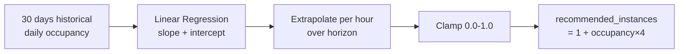

# Analytics Service

## Purpose & Responsibility

The Analytics service provides parking usage insights — peak hour detection, occupancy patterns, and resource predictions — by consuming reservation lifecycle events and computing statistics from historical data using linear regression.

## gRPC API Contract

**Service**: `analytics.v1.AnalyticsService` (port 9095)

| Method | Request | Response | Description |
|--------|---------|----------|-------------|
| GetPeakHours | GetPeakHoursRequest | GetPeakHoursResponse | Peak hour stats from last 30 days |
| GetUsagePatterns | GetUsagePatternsRequest | GetUsagePatternsResponse | Daily occupancy patterns summary |
| PredictResources | PredictResourcesRequest | PredictResourcesResponse | Predicted occupancy and scaling recommendations |

### Request/Response Details

**GetPeakHoursResponse**:
- `stats[]` — hours with above-average occupancy, each containing:
  - `hour` (0-23), `day_of_week` (0-6)
  - `avg_occupancy`, `avg_reservations`, `peak_score`

**GetUsagePatternsResponse**:
- `period` — e.g., `"last_30_days"`
- `avg_utilization` — overall average (0.0–1.0)
- `peak_hours[]` — hours with above-average occupancy
- `idle_hours[]` — hours below 30% occupancy threshold

**PredictResourcesRequest**:
- `horizon_minutes` — prediction window (default: 60)

**PredictResourcesResponse**:
- `predictions[]` — hourly predictions containing:
  - `timestamp`, `predicted_occupancy` (0.0–1.0)
  - `recommended_instances` (1–5), `confidence` (0.0–1.0)

## Configuration

| Key | Default | Description |
|-----|---------|-------------|
| `server.port` | 8086 | HTTP health check port |
| `grpc.server.port` | 9095 | gRPC listen port |
| `grpc.server.request_timeout` | 30s | Per-request deadline |
| `grpc.rate_limit.requests_per_second` | 100 | gRPC rate limit |
| `grpc.rate_limit.burst_size` | 200 | Rate limit burst capacity |
| `database.schema` | reservation | PostgreSQL schema (reads from reservation schema) |
| `database.max_conns` | 25 | PostgreSQL connection pool max |

## Dependencies

| Dependency | Purpose |
|------------|---------|
| PostgreSQL (reservation schema) | Historical reservation data for analytics queries |
| NATS JetStream | Consuming reservation lifecycle events |

## Key Domain Logic

### Peak Hours Detection

1. Query hourly stats from the last 30 days via `repo.GetHourlyStats()`.
2. Calculate the overall average occupancy across all hour/day combinations.
3. Return only hours where `avg_occupancy > overall_average` — these are the peak hours.

### Usage Patterns

1. Aggregate hourly stats into per-hour averages (across all days).
2. **Peak hours**: hours where average occupancy exceeds the overall mean.
3. **Idle hours**: hours where average occupancy falls below 30% (`idleThreshold = 0.30`).

### Resource Prediction (Linear Regression)



- Uses ordinary least squares linear regression on daily occupancy data.
- Requires minimum 2 days of historical data (returns `422 Unprocessable Entity` otherwise).
- Confidence decays linearly with prediction distance: `confidence = max(0.1, 1.0 - dayOffset/30)`.
- Predicted occupancy is clamped to [0.0, 1.0].
- Recommended instances formula: `1 + int(predictedOccupancy * 4)` — scales from 1 to 5 instances.

### Event Recording

The `RecordEvent` method persists reservation lifecycle events received via NATS for future analytics queries. Each event contains reservation_id, driver_id, spot_id, vehicle_type, status, and timestamp.

## Event Publishing/Subscribing

### Consumed Events

| Subject Pattern | Stream | Consumer | Handler |
|-----------------|--------|----------|---------|
| `reservation.analytics.*` | RESERVATION_ANALYTICS | analytics-consumer | handleReservationEvent |

**ReservationEvent** payload:
```json
{
  "reservation_id": "uuid",
  "driver_id": "uuid",
  "spot_id": "uuid",
  "vehicle_type": "car",
  "status": "created|confirmed|checked-in|completed|cancelled|expired|failed",
  "timestamp": "2024-01-01T00:00:00Z"
}
```

### Event Processing

- Poison messages (JSON unmarshal failures) are terminated (`msg.Term()`) to prevent infinite redelivery.
- Processing failures trigger NAK for redelivery (max 5 deliveries configured by the reservation service's stream setup).
- Each message is processed with a 15-second timeout context.
- Successful processing is acknowledged with explicit `msg.Ack()`.

## Error Handling Approach

- Repository failures are logged and wrapped with `apperror.Internal()` — clients see a generic error.
- `PredictResources` validates input: negative/zero horizon returns `apperror.BadRequest`.
- Insufficient historical data (< 2 days) returns `apperror.UnprocessableEntity`.
- NATS handler failures use Nak/Term semantics for reliable redelivery vs. poison message handling.
- Event recording failures are logged with reservation context but do not propagate to the event publisher.
