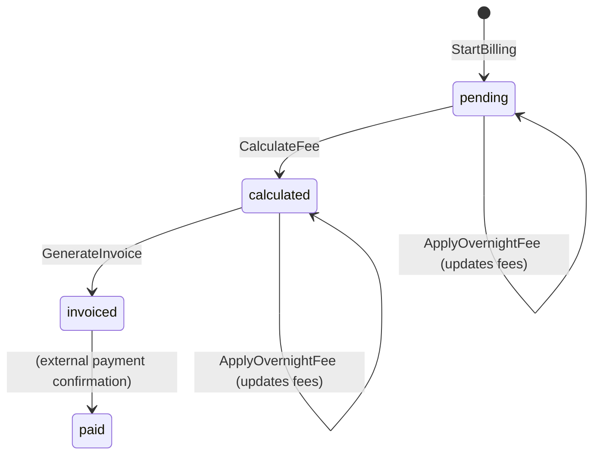

# Billing Service

## Purpose & Responsibility

The Billing service handles fee calculation and invoice generation for parking sessions, implementing the pricing model (booking fee + hourly rate + overnight surcharge) and maintaining billing record state through the reservation lifecycle.

## gRPC API Contract

**Service**: `billing.v1.BillingService` (port 9092)

| Method | Request | Response | Description |
|--------|---------|----------|-------------|
| StartBilling | StartBillingRequest | BillingResponse | Create billing record at reservation confirmation |
| CalculateFee | CalculateFeeRequest | BillingResponse | Compute parking fee from session duration |
| GenerateInvoice | GenerateInvoiceRequest | BillingResponse | Finalize billing record for payment |
| ApplyOvernightFee | ApplyOvernightFeeRequest | BillingResponse | Apply overnight flat fee surcharge |

### Request/Response Details

**StartBillingRequest**:
- `reservation_id` — links billing to reservation
- `booking_fee` — non-refundable fee (5,000 IDR)
- `idempotency_key` — deduplication key

**CalculateFeeRequest**:
- `reservation_id`
- `check_in_at` — session start timestamp
- `check_out_at` — session end timestamp

**BillingResponse**:
- `id`, `reservation_id`, `status`
- `booking_fee`, `parking_fee`, `overnight_fee`, `total_amount`
- `duration_minutes`, `billed_hours`, `is_overnight`
- `idempotency_key`

## Configuration

| Key | Default | Description |
|-----|---------|-------------|
| `server.port` | 8082 | HTTP health check port |
| `grpc.server.port` | 9092 | gRPC listen port |
| `grpc.server.request_timeout` | 30s | Per-request deadline |
| `grpc.rate_limit.requests_per_second` | 100 | gRPC rate limit |
| `grpc.rate_limit.burst_size` | 200 | Rate limit burst capacity |
| `database.max_conns` | 25 | PostgreSQL connection pool max |

## Dependencies

| Dependency | Purpose |
|------------|---------|
| PostgreSQL | Billing record persistence |

The billing service is intentionally simple with no external service dependencies — it is called by the reservation service and operates purely on its own database.

## Key Domain Logic

### Pricing Rules

| Fee Type | Amount | Calculation |
|----------|--------|-------------|
| Booking Fee | 5,000 IDR | Flat, non-refundable, charged at confirmation |
| Hourly Rate | 5,000 IDR/hour | Per started hour (minimum 1 hour) |
| Overnight Fee | 20,000 IDR/night | Per midnight crossed in WIB (UTC+7) |

**Total** = Booking Fee + Parking Fee + Overnight Fee

### Fee Calculation Logic

```
duration = checkOut - checkIn
billedHours = ceil(duration.Hours())  // minimum 1
parkingFee = billedHours × 5,000 IDR

nightsCrossed = count of midnight boundaries (00:00 WIB) between checkIn and checkOut
overnightFee = nightsCrossed × 20,000 IDR
```

Midnight crossing is calculated in WIB (UTC+7) timezone to align with local business hours.

### Billing State Machine



### Idempotency

- `StartBilling` checks both `idempotency_key` and `reservation_id` for existing records.
- `GenerateInvoice` is idempotent — if already invoiced, returns the existing record.
- On unique constraint violation during creation, the existing record is fetched and returned.

### Optimistic Concurrency Control

`CalculateFee` and `ApplyOvernightFee` use optimistic concurrency with up to 2 retries on `ErrConcurrentModification`. The repository layer uses a version check on update to detect concurrent writes.

## Event Publishing/Subscribing

The billing service does not publish or subscribe to any NATS events. It operates as a synchronous gRPC service called by the reservation service during checkout.

## Error Handling Approach

- `ErrCannotCalculate` — returned when attempting to calculate fees on a non-pending record.
- `ErrCannotInvoice` — returned when attempting to invoice a non-calculated record.
- `ErrConcurrentModification` — triggers retry logic (max 2 retries) before surfacing to caller.
- All errors are wrapped with context for debugging (e.g., `"calculate fee get record: ..."`)
- Repository-level `ErrNotFound` and `ErrConflict` are handled explicitly at the usecase layer.
