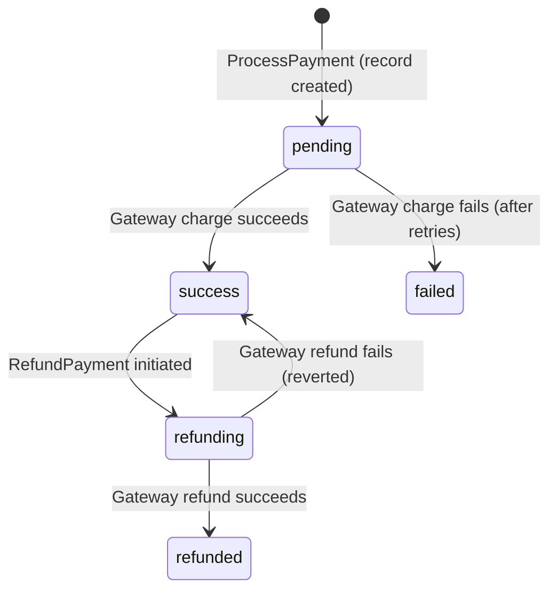

# Payment Service

## Purpose & Responsibility

The Payment service processes financial transactions through a payment gateway abstraction, supporting QRIS payments, refunds, and status queries with idempotency guarantees and retry logic for gateway resilience.

## gRPC API Contract

**Service**: `payment.v1.PaymentService` (port 9093)

| Method | Request | Response | Description |
|--------|---------|----------|-------------|
| ProcessPayment | ProcessPaymentRequest | PaymentResponse | Process payment via configured gateway |
| ProcessQRIS | ProcessQRISRequest | PaymentResponse | QRIS-specific payment (delegates to ProcessPayment) |
| RefundPayment | RefundPaymentRequest | PaymentResponse | Refund a previously completed payment |
| GetPaymentStatus | GetPaymentStatusRequest | PaymentResponse | Query current payment status |

### Request/Response Details

**ProcessPaymentRequest**:
- `billing_id` — links payment to billing record
- `amount` — payment amount in IDR
- `payment_method` — `"qris"`, `"credit_card"`, `"debit"`, `"ewallet"`
- `idempotency_key` — client-generated deduplication key

**PaymentResponse**:
- `id`, `billing_id`, `amount`
- `payment_method`, `payment_gateway` — method and gateway used
- `transaction_ref` — gateway transaction reference
- `status` — current payment status
- `paid_at` — timestamp of successful payment

## Configuration

| Key | Default | Description |
|-----|---------|-------------|
| `server.port` | 8083 | HTTP health check port |
| `grpc.server.port` | 9093 | gRPC listen port |
| `grpc.server.request_timeout` | 30s | Per-request deadline |
| `grpc.rate_limit.requests_per_second` | 100 | gRPC rate limit |
| `grpc.rate_limit.burst_size` | 200 | Rate limit burst capacity |
| `asynq.concurrency` | 10 | Background task worker concurrency |
| `database.max_conns` | 25 | PostgreSQL connection pool max |

## Dependencies

| Dependency | Purpose |
|------------|---------|
| PostgreSQL | Payment record persistence |
| Redis | Asynq task queue |
| NATS JetStream | Publishing payment result events |
| Payment Gateway (stub) | External payment processing |

## Key Domain Logic

### Payment State Machine



### Gateway Retry Strategy

Payment gateway calls (`Charge` and `Refund`) use the `retry.DefaultConfig()` pattern:
- Retries on transient failures with exponential backoff.
- On context cancellation/deadline exceeded: marks payment as failed immediately and uses a fresh 5-second context for the status update.
- On permanent gateway failure: marks as failed and publishes a `payment.reservation.failed` event.

### Refund Safety

Refunds use a two-phase approach to prevent concurrent refund races:
1. **Status lock**: Atomically transition from `success` → `refunding` using `UpdatePaymentWithStatusCheck` (optimistic lock).
2. **Gateway call**: Call `gateway.Refund()` with retry.
3. **Final state**: On success → `refunded`. On failure → revert to `success`.

This ensures only one refund can proceed at a time for a given payment.

### Idempotency

- `ProcessPayment` checks `idempotency_key` before creating a new record.
- On unique constraint violation, the existing payment is returned.
- `RefundPayment` supports optional idempotency key for safe retries.

## Event Publishing (NATS Subjects)

### Published Events

| Subject | Trigger | Payload |
|---------|---------|---------|
| `payment.reservation.success` | Payment charge succeeds | PaymentResultEvent |
| `payment.reservation.failed` | Payment charge fails | PaymentResultEvent |

**PaymentResultEvent** schema:
```json
{
  "payment_id": "uuid",
  "reservation_id": "uuid",
  "amount": 10000,
  "status": "success|failed",
  "reason": "optional failure reason",
  "timestamp": "2024-01-01T00:00:00Z"
}
```

### Stream Configuration

| Stream | Subjects | Retention | Max Age |
|--------|----------|-----------|---------|
| PAYMENT_RESERVATION | `payment.reservation.*` | Interest | 24h |

Message deduplication uses `msgID` format: `pay-success-{paymentID}` / `pay-failed-{paymentID}`.

## Error Handling Approach

- `ErrCancelled` — wraps context cancellation errors, signals caller should not retry.
- `ErrCannotRefund` — returned when attempting to refund a non-success payment.
- `ErrRefundFailed` — gateway refund failed after retries; original payment status is reverted to `success`.
- Gateway failures are retried transparently; only permanent failures surface to the caller.
- Event publishing failures are logged but never block the payment response (best-effort).
- Context cancellation during gateway calls triggers a fresh context for cleanup operations to ensure the payment record is updated even if the parent context is dead.
