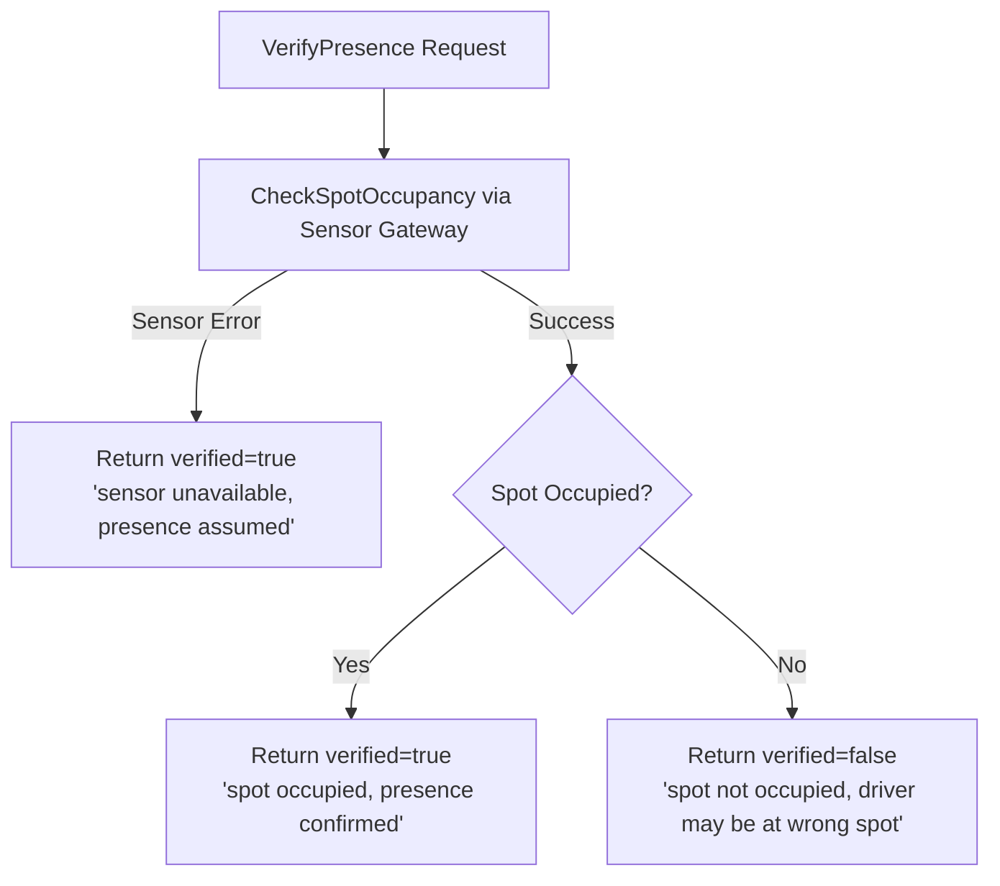

# Presence Service

## Purpose & Responsibility

The Presence service verifies driver presence at assigned parking spots using sensor data, providing a non-blocking validation layer during check-in that gracefully degrades when sensors are unavailable.

## gRPC API Contract

**Service**: `presence.v1.PresenceService` (port 9095)

| Method | Request | Response | Description |
|--------|---------|----------|-------------|
| VerifyPresence | VerifyPresenceRequest | VerifyPresenceResponse | Check if spot sensor detects occupancy |

### Request/Response Details

**VerifyPresenceRequest**:
- `driver_id` — driver being verified
- `reservation_id` — associated reservation
- `floor_number` — floor of assigned spot
- `spot_number` — spot number on the floor

**VerifyPresenceResponse**:
- `verified` — boolean indicating presence confirmation
- `message` — human-readable status message

## Configuration

| Key | Default | Description |
|-----|---------|-------------|
| `server.port` | 8085 | HTTP health check port |
| `grpc.server.port` | 9095 | gRPC listen port |
| `grpc.server.request_timeout` | 30s | Per-request deadline |
| `grpc.rate_limit.requests_per_second` | 150 | gRPC rate limit |
| `grpc.rate_limit.burst_size` | 300 | Rate limit burst capacity |
| `redis.db` | 2 | Redis database index (isolated) |
| `redis.pool_size` | 20 | Redis connection pool size |
| `database.max_conns` | 20 | PostgreSQL connection pool max |

## Dependencies

| Dependency | Purpose |
|------------|---------|
| PostgreSQL | Spot metadata (floor/spot mapping) |
| Redis (db 2) | Sensor data caching |
| Sensor Gateway | Hardware sensor integration (stub in development) |

## Key Domain Logic

### Verification Flow



### Graceful Degradation Design

The presence service is designed as a **non-blocking advisory layer**:

1. **Sensor failure → assume presence**: If the sensor gateway returns an error, the service returns `verified=true` with a warning message. This prevents sensor hardware issues from blocking the check-in flow.

2. **Service unavailability → skip verification**: The reservation service treats the presence client as optional. If the presence service is unreachable, check-in proceeds without verification.

3. **Wrong spot → warning only**: If the sensor reports the spot is unoccupied, the reservation service logs a warning and sets `WrongSpotWarning=true` on the response, but does not block the check-in.

This three-layer degradation ensures that hardware or network issues never prevent a driver from completing their parking session.

### Sensor Gateway Abstraction

The `SensorGateway` interface abstracts hardware communication:

```go
type SensorGateway interface {
    CheckSpotOccupancy(ctx context.Context, floorNumber int, spotNumber int) (*SensorReading, error)
}
```

**SensorReading**:
- `Occupied` — boolean occupancy state
- `DetectedAt` — timestamp of the reading

In development, a `StubSensorGateway` always returns `Occupied: true`, simulating a working sensor array.

## Event Publishing/Subscribing

The Presence service does not publish or subscribe to any NATS events. It operates as a synchronous gRPC service called by the reservation service during check-in.

## Error Handling Approach

- Sensor errors are handled with graceful degradation — logged as warnings, presence is assumed.
- The service never returns an error to the caller for sensor failures; it always returns a valid `VerifyPresenceResponse`.
- Infrastructure errors (database, Redis) that prevent the service from starting are fatal and cause process exit.
- The calling service (reservation) wraps presence calls in error handling that logs and continues on failure.
