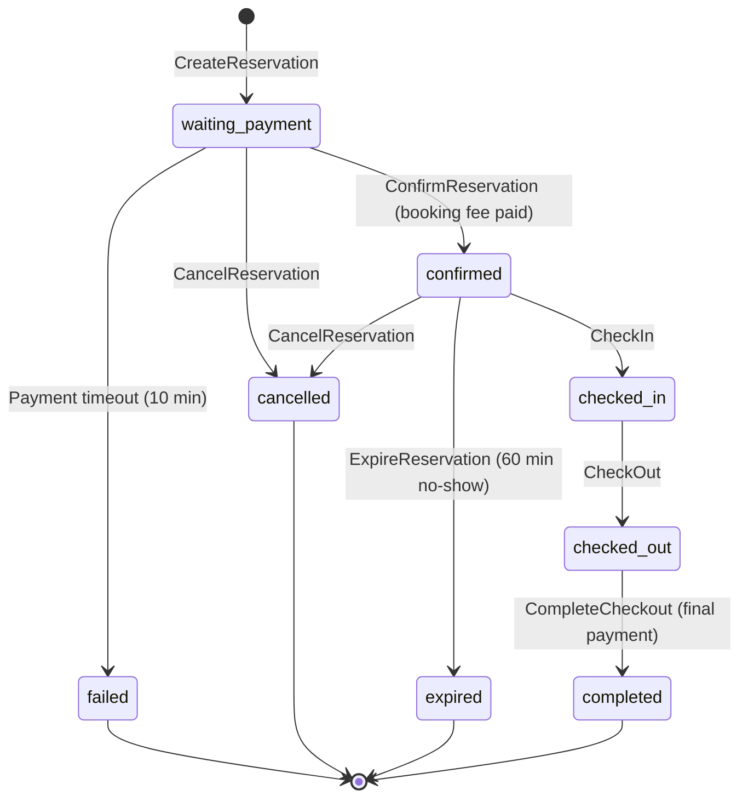

# Reservation Service

## Purpose & Responsibility

The Reservation service owns the full parking reservation lifecycle — from spot assignment through check-in, check-out, and completion — coordinating with billing, payment, and presence services while maintaining strong consistency guarantees via distributed locking and database transactions.

## gRPC API Contract

**Service**: `reservation.v1.ReservationService` (port 9091)

| Method | Request | Response | Description |
|--------|---------|----------|-------------|
| CreateReservation | CreateReservationRequest | ReservationResponse | Idempotent spot reservation with distributed lock |
| GetReservation | GetReservationRequest | ReservationResponse | Retrieve by ID with ownership enforcement |
| CancelReservation | CancelReservationRequest | ReservationResponse | Cancel and release spot |
| CheckIn | CheckInRequest | ReservationResponse | Mark checked-in, optional presence verification |
| CheckOut | CheckOutRequest | CheckOutResponse | Calculate fee and generate invoice |
| ConfirmReservation | ConfirmReservationRequest | ReservationResponse | Process booking fee payment |
| CompleteCheckout | CompleteCheckoutRequest | CheckOutResponse | Process final payment and release spot |
| ExpireReservation | ExpireReservationRequest | ReservationResponse | Expire no-show reservation |
| ListByDriver | ListByDriverRequest | ListByDriverResponse | List reservations with optional status filter |

### Key Request Fields

**CreateReservationRequest**:
- `driver_id` — owner of the reservation
- `vehicle_type` — `"car"` or `"motorcycle"`
- `assignment_mode` — `"system_assigned"` or `"user_selected"`
- `spot_id` — required only for `user_selected`
- `idempotency_key` — client-generated deduplication key

**CheckOutResponse** includes fee breakdown:
- `total_amount`, `booking_fee`, `parking_fee`, `overnight_fee`
- `billing_id`, `payment_id`

## Configuration

| Key | Default | Description |
|-----|---------|-------------|
| `server.port` | 8081 | HTTP health check port |
| `grpc.server.port` | 9091 | gRPC listen port |
| `grpc.server.request_timeout` | 30s | Per-request deadline |
| `reservation.payment_timeout_minutes` | 10 | Window to complete booking fee payment |
| `reservation.expiry_timeout_minutes` | 60 | Window to check in after confirmation |
| `reservation.worker_poll_interval` | 30s | Asynq worker poll interval |
| `asynq.concurrency` | 10 | Background task worker concurrency |
| `grpc.rate_limit.requests_per_second` | 100 | gRPC rate limit |

## Dependencies

| Dependency | Purpose |
|------------|---------|
| PostgreSQL | Reservation and spot persistence |
| Redis | Distributed locking (SETNX), Asynq task queue |
| Billing Service (gRPC :9093) | StartBilling, CalculateFee, GenerateInvoice |
| Payment Service (gRPC :9094) | ProcessPayment, RefundPayment |
| Presence Service (gRPC :9095) | VerifyPresence (optional, graceful degradation) |
| NATS JetStream | Event publishing (spot updates, analytics) |
| Asynq | Delayed task scheduling (expiry, payment timeout) |

## Key Domain Logic

### Reservation State Machine

### Distributed Lock Strategy

1. **Redis SETNX lock** on `spot:{spotID}` with 12-minute TTL (covers payment timeout window).
2. **No retry** — if lock is held, immediately return `409 Conflict` ("spot is being reserved by another driver").
3. Lock is released in `defer` after the transaction completes.
4. **Double-check under DB row lock**: Even after acquiring the Redis lock, the spot is re-verified with `SELECT FOR UPDATE` inside the transaction to prevent TOCTOU races.

### Idempotency

- `FindByIdempotencyKey` is checked before any mutation.
- On unique constraint violation, the existing record is returned rather than erroring.
- Billing and payment calls use deterministic idempotency keys derived from the reservation ID (e.g., `billing-{reservationID}`, `booking-payment-{reservationID}`).

### Concurrency Safety

All state transitions use `SELECT FOR UPDATE` within transactions to prevent TOCTOU races. If a concurrent modification is detected (e.g., during ConfirmReservation), compensating actions are triggered (refund the orphaned payment).

### Constraint: One Active Reservation Per Driver

Enforced by a partial unique index `idx_reservations_one_active_per_driver` at the database level.

## Event Publishing (NATS Subjects)

### Published Events

| Subject | Trigger | Payload |
|---------|---------|---------|
| `reservation.search.spot-updated` | Any spot status change | SpotUpdatedEvent (spot_id, floor, status) |
| `reservation.analytics.created` | CreateReservation | ReservationEvent |
| `reservation.analytics.confirmed` | ConfirmReservation | ReservationEvent |
| `reservation.analytics.checked-in` | CheckIn | ReservationEvent |
| `reservation.analytics.completed` | CompleteCheckout | ReservationEvent |
| `reservation.analytics.cancelled` | CancelReservation | ReservationEvent |
| `reservation.analytics.expired` | ExpireReservation | ReservationEvent |
| `reservation.analytics.failed` | FailReservation | ReservationEvent |

### Consumed Events

| Subject | Stream | Consumer | Purpose |
|---------|--------|----------|---------|
| `payment.reservation.*` | PAYMENT_RESERVATION | reservation-payment-consumer | React to async payment results |

### Stream Configuration

| Stream | Subjects | Retention | Max Age |
|--------|----------|-----------|---------|
| RESERVATION_SEARCH | `reservation.search.*` | Interest | 24h |
| RESERVATION_ANALYTICS | `reservation.analytics.*` | Limits | 7 days |
| PAYMENT_RESERVATION | `payment.reservation.*` | Interest | 24h |

## Error Handling Approach

- Domain errors are mapped to gRPC status codes via a centralized `mapError()` function.
- `ErrNotFound` → `codes.NotFound`
- `ErrConflict`, `ErrAlreadyActive`, `ErrSpotLocked` → `codes.AlreadyExists`
- `ErrInvalidTransition` → `codes.FailedPrecondition`
- `ErrForbidden` → `codes.PermissionDenied`
- `ErrPaymentFailed`, `ErrBillingFailed` → `codes.Aborted`
- Event publishing failures are logged but never block the primary operation (best-effort).
- Asynq task enqueue failures are logged but do not fail the reservation creation.
- If billing record creation fails during CreateReservation, the reservation is transitioned to `failed` and the spot is released (compensating action).
