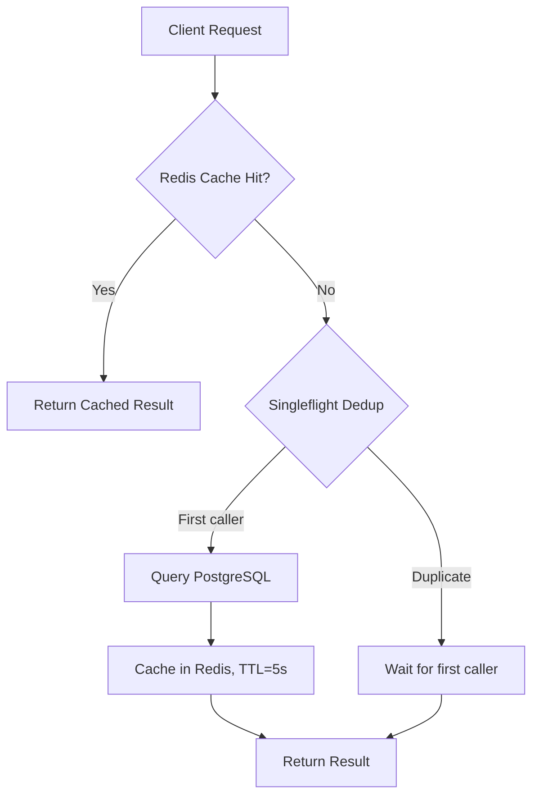

# Search Service

## Purpose & Responsibility

The Search service provides real-time parking availability queries with low-latency responses, using Redis caching with singleflight deduplication and a CQRS read model that stays synchronized via NATS event consumption.

## gRPC API Contract

**Service**: `search.v1.SearchService` (port 9094)

| Method | Request | Response | Description |
|--------|---------|----------|-------------|
| GetAvailability | GetAvailabilityRequest | AvailabilityResponse | Per-floor availability counts by vehicle type |
| GetFloorMap | GetFloorMapRequest | FloorMapResponse | Status of every spot on a floor |
| GetSpotDetails | GetSpotDetailsRequest | SpotDetailsResponse | Detailed info for a specific spot |

### Request/Response Details

**GetAvailabilityRequest**:
- `vehicle_type` — `"car"` or `"motorcycle"`

**AvailabilityResponse**:
- `floors[]` — per-floor breakdown (available_car, available_moto, total_car, total_moto)
- `total` — aggregate (total_available, total_capacity)

**FloorMapResponse**:
- `spots[]` — all spots on the floor with id, spot_code, vehicle_type, status, floor/spot numbers

**SpotDetailsResponse**:
- Single spot: id, spot_code, floor_number, spot_number, vehicle_type, status

## Configuration

| Key | Default | Description |
|-----|---------|-------------|
| `server.port` | 8084 | HTTP health check port |
| `grpc.server.port` | 9094 | gRPC listen port |
| `grpc.server.request_timeout` | 30s | Per-request deadline |
| `grpc.rate_limit.requests_per_second` | 200 | gRPC rate limit (higher than other services) |
| `grpc.rate_limit.burst_size` | 400 | Rate limit burst capacity |
| `redis.db` | 1 | Redis database index (isolated from other services) |
| `redis.pool_size` | 15 | Redis connection pool size |
| `database.max_conns` | 25 | PostgreSQL connection pool max |

## Dependencies

| Dependency | Purpose |
|------------|---------|
| PostgreSQL | Spot inventory read model |
| Redis (db 1) | Query result caching |
| NATS JetStream | Consuming spot status update events |

## Key Domain Logic

### Caching Strategy



- **Cache TTL**: 5 seconds — balances freshness with load reduction.
- **Singleflight**: Prevents thundering herd on cache miss. Uses `context.WithoutCancel` so the first caller's cancellation doesn't abort the query for waiting callers.
- **Singleflight timeout**: 10 seconds — prevents indefinite blocking.
- **Cache keys**: `availability:{vehicleType}`, `floormap:{floorNumber}`

### CQRS Read Model Synchronization

The search service maintains its own read model of spot statuses, updated asynchronously via NATS events:

1. Reservation service publishes `reservation.search.spot-updated` on any spot status change.
2. Search service's NATS handler receives the event and calls `HandleSpotUpdated`.
3. `HandleSpotUpdated` upserts the spot in the read model and **invalidates** affected cache keys.

This design rationale:
- Decouples search queries from the reservation service's write path.
- Allows the search service to scale independently with its own database schema.
- Cache invalidation on event receipt ensures eventual consistency within seconds.

### GetSpotDetails

Direct database query without caching — used for single-spot lookups where caching overhead isn't justified.

## Event Publishing/Subscribing

### Consumed Events

| Subject Pattern | Stream | Consumer | Handler |
|-----------------|--------|----------|---------|
| `reservation.search.*` | RESERVATION_SEARCH | search-spot-consumer | handleSpotUpdated |

**SpotUpdatedEvent** payload:
```json
{
  "spot_id": "uuid",
  "floor_number": 1,
  "spot_number": 5,
  "vehicle_type": "car",
  "spot_code": "F1-C05",
  "status": "available|reserved|occupied",
  "updated_at": "2024-01-01T00:00:00Z"
}
```

### Event Processing

- Poison messages (unmarshal failures) are terminated (`msg.Term()`) to prevent infinite redelivery.
- Processing failures trigger NAK for redelivery.
- Each message is processed with a 15-second timeout context.

## Error Handling Approach

- Cache read/write failures are logged as warnings and fall through to database queries — Redis is treated as an optimization, not a requirement.
- JSON unmarshal failures on cached data trigger a cache miss (re-query from DB).
- Singleflight type assertion failures return a descriptive error.
- NATS event processing uses explicit Ack/Nak/Term semantics for reliable delivery.
